# 校园活动协同与资源调度系统 软件设计文档

# 校园活动协同与资源调度系统

# 软件设计文档

软件综合实践  学习通分组任务4

编制日期 2026年10月28日

项目性质 六人协作课程设计

项目成员 冀项阳、冯玉琪、黄方勇、汤雨润、杨瀚霖、杨畅

设计员 黄方勇 55230315
项目经理 冀项阳 55230223

目录

阅读方式：先阅读第2、3章了解类职责、接口和事务规则，再按用例编号查看第4章。每个用例分为基本流页和备选流页；图中调用消息在第5章均有同名操作。

## 1 设计依据与范围

本设计说明活动申请、业务审批、资源联合预约、发布报名、改期协同、故障处理和通知追踪如何由系统内部的类与接口共同完成。设计以20个用例为索引，将基本流和备选流落实到对象协作，并明确事务边界和失败后的数据状态。

| 组成 | 内容 |
| --- | --- |
| 设计模型 | 子系统、分层依赖、领域实体、参与类与操作 |
| 用例实现 | UC-01至UC-20的基本流与备选流顺序图 |
| 关键机制 | 统一幂等、并发锁序、原子改期、资格复核与隐私裁剪 |
| 追踪关系 | 用例、HTTP接口、类操作及验收场景对应 |

课程讲义要求以边界类、控制类、实体类识别协作对象，以顺序图实现用例事件流，并按接口划分子系统。本设计沿用这一方法，同时保持项目现有的Java 21、Spring Boot、Spring JDBC与PostgreSQL单体架构，前端设计采用Vue 3和TypeScript。

范围覆盖需求规约v1.1的UC-01至UC-20。角色仅为APPLICANT、APPROVER和ADMIN；TEACHER/STUDENT是独立身份。工作人员与报名人员是人与活动的关系，不另建角色继承树。本次课程项目实现活动申请、审批、资源预约、报名、改期与站内通知，不涉及现场签到、费用支付、短信通知或学校统一登录；资源调度提供冲突检查和备选方案，不保证全局最优。

实现对照点为本地work/55230315-scheduling，HEAD及获取后的origin/main均为34dc4d5；同时核对当前工作区的调度代码。文中“已有”仅指源码存在，“设计”表示待实现职责，“接口”表示已定义的跨模块契约；不据此宣称整机集成或验收完成。

现有类与接口沿用源码命名，新增控制类作为后续实现设计。公共DTO、状态和端口签名以开发任务包v3.0为准，设计关系与需求、界面及测试材料交叉追踪。

## 2 子系统与设计模型

### 2.1 分层与依赖

系统部署为一个前端、一个Spring Boot应用和一个PostgreSQL数据库。子系统是逻辑职责边界，不意味着拆成多个微服务。界面依赖HTTP接口，业务编排依赖contract中的端口，端口适配器封装各模块数据访问。

图2-1 子系统组成与分层

### 2.2 子系统包含的类与协作边界

| 子系统 | 主要类 | 提供与依赖 |
| --- | --- | --- |
| web | LoginPage、ActivityListPage、UserAdminPage、ResourceAdminPage、CalendarPage、ActivityEditPage、ActivityDetailPage、ChangeWorkbenchPage、ChangeDetailPage、ReviewPage、NotificationPage | 边界类设计；调用统一API客户端，不持有领域对象的长期关联 |
| foundation/；auth/；contract | AuthController、UserController、SessionService、UserService、AccountRepository、AccountPortAdapter、AuthorizationPolicy、CommandExecutor、Responses | 提供AccountPort；contract存放统一DTO和五类端口 |
| activity/；registration | ActivityService、ActivityQueryService、ActivityRepository、ActivityPortAdapter、RegistrationService、RegistrationRepository、ActivityStateMachine | 提供ActivityPort；使用AccountPort、SchedulingPort、ChangePort、EventPort |
| resource/；scheduling | ResourceController、ResourceService、ResourceRepository、ScheduleController、ScheduleQueryService、SchedulingPortAdapter、ConstraintChecker、CapacitySweep、TimeInterval、CandidateSearch、CandidateRanking、StrategyEvaluator、StrategyResult | 提供SchedulingPort；预览查询独立消费ActivityPort，适配器不反向依赖活动服务 |
| change | ChangeService、ChangeRepository、ChangePortAdapter | 提供ChangePort；ChangeService依赖ActivityPort、AccountPort、SchedulingPort、EventPort；ChangePortAdapter仅访问自己的Repository |
| notification/；audit | EventPortAdapter、EventRepository、OutboxWorker、NotificationService、NotificationRepository、AuditService、AuditRepository | 提供EventPort；事件追加不锁活动行；消费者仅按快照投递 |

HTTP控制器负责绑定DTO、从认证上下文取得Actor和构造统一响应；业务判断位于控制类。尚未落地的控制器按ActivityController、RegistrationController、ChangeController、NotificationController、AuditController命名设计，与上述业务服务一一委托；不新增HTTP端点。

循环依赖消解：ActivityPortAdapter可使用SchedulingPort.risk与ChangePort.pendingId；ChangePortAdapter只依赖ChangeRepository。SchedulingPortAdapter只依赖自身资源查询与算法类；需读取活动的预览逻辑放入ScheduleQueryService。业务包之间虽有双向业务协作，Spring对象依赖链不得形成循环。

### 2.3 领域实体类图

图2-2 领域实体的属性与关联多重性

图中每条关系的多重性按起点:终点标注。另有Activity 1—0..* Registration关联；Activity.effectiveVersionNo可空，非空时指向本活动恰一个ActivityVersion。

实线表示持久关联，由外键或记录内ID实现，不表示服务调用。活动版本生命周期从属活动，但历史保留且禁止删除，因此此处使用普通关联，不误画为级联删除的组合。Actor、ActivityView等Java record是不可变数据载体，不人为添加业务继承关系。领域实体的持久化行为由服务与Repository承担。

### 2.4 设计类关系与操作可见性

图2-3 端口与控制类的实现及依赖

继承只用于存在“是一个”且满足替换关系的类型。三个角色以及教师/学生身份采用枚举和授权集合，不建Teacher extends Approver等错误继承。接口适配使用实现关系，不能用普通实体关联代替。

### 2.5 核心参与类的依赖与实现图

图2-4 改期与调度核心参与类图

虚线开箭头表示调用依赖，虚线空心三角表示接口实现。ChangeService还调用EventPort.append和AccountPort.lock；ActivityPortAdapter读取SchedulingPort.risk与ChangePort.pendingId。这些依赖均指向接口，不反向引用业务控制器。其余参与类及全部消息操作在第5章展开。

### 2.6 页面边界类与参与者

根据《用户界面说明文档》的UI-01至UI-11，将页面入口对应到边界类。页面仅处理输入与结果呈现，授权、资格和状态转换由后端完成；教师/学生身份与三种业务角色独立。

| 界面及边界类 | 使用者与操作 | 协作类与用例 |
| --- | --- | --- |
| UI-01 登录；LoginPage | 全部用户：登录、退出、恢复会话 | SessionService；UC-01 |
| UI-02 活动列表；ActivityListPage | 申请人及授权人员：我的/公开活动、状态筛选、详情入口 | ActivityQueryService；UC-03/05/09 |
| UI-03 活动申请；ActivityEditPage | 申请人：新建、编辑、资源预览及提交入口 | ActivityService、ScheduleQueryService；UC-05/06/11 |
| UI-04 活动详情；ActivityDetailPage | 所有者与授权人员；学生本人报名/退出 | ActivityService、RegistrationService、AuditService；UC-03/06/09/10/17/20 |
| UI-05 资源日历；CalendarPage | 登录用户：查看占用与风险，按权限进入详情 | ResourceService；UC-03 |
| UI-06 资源管理；ResourceAdminPage | 资源管理员：新增、资格调整、故障及影响查询 | ResourceService；UC-04/18 |
| UI-07 改期工作台；ChangeWorkbenchPage | 所有者：比较2至3个候选、查看差异与影响、创建申请 | ScheduleQueryService、ChangeService；UC-11/12 |
| UI-08 改期详情；ChangeDetailPage | 指定工作人员本人确认；所有者撤回；授权人员查看 | ChangeService；UC-13至16 |
| UI-09 审核待办；ReviewPage | 批准人及资源复核管理员：范围内审批，所有者回避 | ActivityService、ChangeService；UC-07/08/14/15 |
| UI-10 通知；NotificationPage | 本人：未读筛选、已读和重新鉴权后的跳转 | NotificationService；UC-19 |
| UI-11 账号管理；UserAdminPage | ADMIN且USER_MANAGE：身份、角色、范围及启停 | UserService；UC-02 |

ActivityListPage是为UI-02补充的设计边界类，主要操作为render()；列表与日历共享只读查询服务。界面不建立额外业务端点，沿用既有40项API。图4-03a以日历入口展示共享查询协作。

交互约束：选择方案后重新计算影响；原/新安排并列显示；通知已读不推进人员确认；409后保留输入并刷新最新状态。日历被截断时要求缩小范围，不将未加载区域显示为空闲。

## 3 事务与关键机制

### 3.1 统一请求与失败处理

所有持久化POST/PATCH/PUT（登录和退出除外）均由CommandExecutor.execute(actor,key,route,canonicalJson,action)包裹。先占位并锁command_receipt，校验路由和规范JSON哈希；同key同请求重放首次完整状态及信封，同key不同请求返回409 IDEMPOTENCY_KEY_REUSED。未登录或会话失效返回401，越权返回403。

事务锁序为receipt → activity → change → user → resource，多用户和多资源分别按UUID排序。不存在的环节略过。锁后读取最新身份、权限、资格和版本；不得先锁资源再回头取活动锁。端口写操作使用MANDATORY加入外层事务，不允许以REQUIRES_NEW破坏原子性。

取消时先锁活动，调用ChangePort.cancelPending锁定并关闭待改期，再锁用户复核授权；若复核不通过则抛出异常，整个事务回滚，先前关闭改期不会提交。随后释放资源、取消报名、取消活动并追加事件。这使现有ChangePort契约能遵守统一锁序，无需新增公共端口。

图3-1 写命令共用事务骨架（Repository与BusinessAction为职责抽象）

CommandReceiptRepository和BusinessAction是本图对现有CommandExecutor内JDBC与Supplier回调的设计职责抽象，不表示仓库已存在同名Java文件。后续用例图省略此骨架及无业务逻辑的Controller转发，页面→服务箭头表示经既有HTTP入口委托，不能理解为浏览器直连Java对象。

### 3.2 业务失败与系统异常

普通校验异常回滚业务及receipt。最终改期的资源冲突是需记录的业务结果：持久化CONFLICTED、冲突详情及事件，正常提交409 CommandResult；不能抛异常使冲突记录回滚。SQL异常则必须使版本、预约、报名、改期、审计、outbox及receipt一并回滚。网络结果未知时保留原key和请求体，查询状态或重试，不自动生成新key。

### 3.3 调度与原子改期约束

资源占用采用[startAt-setupMinutes,endAt+teardownMinutes)半开区间，必须完整落在同一上海自然日与全部资源开放区间。端点相接不冲突；设备数量检查同时峰值，故障扣减后可用量下限为0。场地quantity固定1、容量满足预计人数，设备capacity为空。

CapacitySweep按时间端点累计预约及故障增减，先评价上一段再合并同刻变化，等价于结束优先，避免把非同时占用直接求和。ConstraintChecker.check输出精确冲突区间及需求/可用量。资格不足返回403 RESOURCE_INELIGIBLE，不伪装为库存冲突。

CandidateSearch按0、-30、+30、-60、+60、-90、+90、-120、+120分钟偏移生成候选，场地按UUID排序，保留原设备或单项同类替换。过滤资格及硬约束，检查最多300个完整组合，去重后按绝对偏移、换场地、替换项数、startAt、venueId和规范设备JSON排序，最多返回5项。未找到方案只表示当前范围内无解。

| 不变量 | 设计保证 |
| --- | --- |
| 首次联合预约 | lockAndCheck成功后才能replaceReservations；当前事务凭据绑定完整Plan；全部资源成功或全部不占用 |
| 改期失败保护 | 冲突保留原有效版本及原ACTIVE预约；原风险为AT_RISK时仍如实显示 |
| 改期成功 | activatePlan更新版本及ACTIVE报名；replaceReservations释放旧预约并写新预约；APPLIED、审计、outbox共同提交 |
| 资格变更 | 操作者和所有者最新身份/权限、资源最新资格均在锁后读取；旧生效预约不自动释放 |
| 报名并发 | 所有报名与改期创建共用活动锁；待处理改期冻结JOIN和WITHDRAW；唯一活动/用户关系 |
| 异步通知 | outbox每2秒最多20条，独立事务消费；失败最多5次，按2/4/8/16/32秒退避；终态FAILED保留原因；eventId+recipientId唯一 |

### 3.4 状态与界面反馈

活动正常链为DRAFT→PENDING_APPROVER→APPROVED_UNRESERVED→SCHEDULED→OPEN；拒绝回DRAFT，撤回克隆新草稿，取消进入不可逆CANCELLED。改期正常链为AWAITING_CONFIRMATIONS→PENDING_APPROVER→PENDING_RESOURCE→APPLIED；无其他工作人员跳过确认。REJECTED、CONFLICTED、WITHDRAWN、CANCELLED_BY_ACTIVITY均终结冻结。

页面的禁用按钮只作提示，后端仍检查完整权限。409后保留输入并重新GET实体；人员确认与通知已读严格分离。公开详情隐藏工作人员ID，工作人员改期视图隐藏报名与通知收件人ID，但registeredCount保持真实。

## 4 用例实现

本章按需求用例编号组织基本流与备选流；页面、控制类和端口之间的调用共同落实用户目标。所有写操作复用第3章的认证、幂等与事务规则。

### 4.1  UC-01 登录与退出

接口：API-01—03。参与边界：LoginPage；主要控制类：SessionService。

前置条件：登录时已具备账号；退出时有当前会话。

输入：用户名、密码。

图4-01a 基本流顺序图

#### 基本流的对象职责

登录以密码及启用状态创建8小时会话；刷新通过 /auth/me 获取当前账号；退出删除当前令牌对应会话。AccountRepository.get 用于登录后的当前账号装配，凭据查询和会话写入由 SessionService 的 JDBC 完成。

成功后置条件：登录建立有效会话；服务器确认退出后旧令牌失效。

需求与验收追踪：FR-01；BR-01、05；D-AT-01及N-AT-01；页面UI-01。

参与类关系：LoginPage ..> SessionService；SessionService通过图中接口调用协作类。全部调用操作见第5章；实体关联与实现关系分别见图2-2、图2-3。

#### UC-01 备选流与异常流

分支编号与用例规约一致；每个alt片段为该条件下的独立执行轨迹，与基本流共享认证、版本检查和事务骨架。返回虚线是结果，不要求作为类操作。

图4-01b 备选流顺序图

2a  密码错误、账号停用或认证失败，显示统一认证错误且不建立会话

3a  会话过期或被停用，后续请求拒绝并要求重新登录

4a  刷新页面时校验当前会话，校验失败回登录

6a  退出网络结果不明确时，清除本地会话并提示服务器退出结果待核实，不展示虚假成功。

### 4.2  UC-02 管理账号身份与授权

接口：API-04—06、38、39。参与边界：UserAdminPage；主要控制类：UserService。

前置条件：已登录且具备相应账号管理权限；目标组织存在。

输入：用户名、显示名、初始密码、组织、教师／学生身份、角色、授权范围或启用状态。

图4-02a 基本流顺序图

#### 基本流的对象职责

list、create、replace、enabled 是分别发起的操作；每项写操作独立进入统一幂等事务。完整替换身份、角色和范围，保存授权前后值；停用同时使会话失效。

成功后置条件：账号资料和授权可重新查询，修改可追踪。

需求与验收追踪：FR-02、03；BR-01、02；D-AT-01／02、N-AT-01／06；页面UI-11。

参与类关系：UserAdminPage ..> UserService；UserService通过图中接口调用协作类。全部调用操作见第5章；实体关联与实现关系分别见图2-2、图2-3。

#### UC-02 备选流与异常流

分支编号与用例规约一致；每个alt片段为该条件下的独立执行轨迹，与基本流共享认证、版本检查和事务骨架。返回虚线是结果，不要求作为类操作。

图4-02b 备选流顺序图

4a  用户名重复、组织不存在、密码不足8位或授权字段无效，拒绝并保留输入

4b  只有资源权限的管理员尝试管理账号，拒绝

5a  停用使现存令牌失效

5b  授权变更后后续操作按最新权限检查；身份变更后，新的申请和待资源复核事项应重新检查申请资格。

### 4.3  UC-03 查询活动及资源日历

接口：API-07、09、13、14。参与边界：CalendarPage；主要控制类：ActivityQueryService。

前置条件：已登录；详情对象存在且可查看。

输入：本人／公开／审核范围、活动状态、日期区间、资源或类型。

图4-03a 基本流顺序图

#### 基本流的对象职责

查询按访问范围过滤后读取201项，输出最多200项及truncated。日历按SETUP、EVENT、TEARDOWN、FAULT分段；无权访问的活动隐藏ID和标题。详情读取当前有效版本及实时风险。

成功后置条件：用户获得授权范围内最新信息，不写预约。

需求与验收追踪：FR-06、11；BR-05、06、09；D-AT-04／05／18／21／23；页面UI-02／04／05。

参与类关系：CalendarPage ..> ActivityQueryService；ActivityQueryService通过图中接口调用协作类。全部调用操作见第5章；实体关联与实现关系分别见图2-2、图2-3。

#### UC-03 备选流与异常流

分支编号与用例规约一致；每个alt片段为该条件下的独立执行轨迹，与基本流共享认证、版本检查和事务骨架。返回虚线是结果，不要求作为类操作。

图4-03b 备选流顺序图

1a  无数据提供创建或调整筛选入口

1b  列表截断提示最多200项，不能显示为完整总数

2a  日历请求超过7天拒绝并提示调整范围

5a  无私有活动访问权限，只显示“已占用”并无私有详情链接

6a  不存在／无权限分别给出对应反馈，不泄露名单。

### 4.4  UC-04 维护资源及申请资格

接口：API-07、08、40。参与边界：ResourceAdminPage；主要控制类：ResourceService。

前置条件：已登录且对目标资源具备管理权限。

输入：类型、名称、类别、容量／库存、每日开放时段、两类身份申请许可。

图4-04a 基本流顺序图

#### 基本流的对象职责

创建资源与授予创建者资源范围在同一事务完成。资格修改另起一个命令，按用户→资源顺序加锁，再保存两类身份开关及前后值。创建后不提供容量、库存、时段和名称的修改入口。

成功后置条件：资源和资格持久化且可追踪，符合资格的候选搜索使用新配置。

需求与验收追踪：FR-04、05；BR-03、04、08、10；N-AT-02／03／04／06；页面UI-06。

参与类关系：ResourceAdminPage ..> ResourceService；ResourceService通过图中接口调用协作类。全部调用操作见第5章；实体关联与实现关系分别见图2-2、图2-3。

#### UC-04 备选流与异常流

分支编号与用例规约一致；每个alt片段为该条件下的独立执行轨迹，与基本流共享认证、版本检查和事务骨架。返回虚线是结果，不要求作为类操作。

图4-04b 备选流顺序图

3a  场地quantity不为1、容量非正、设备capacity非空、库存非正或开放时间逆序，拒绝

5a  调整资格后待确认申请按最新资格检查

5b  已生效预约保留

5c  尝试修改创建后的容量、库存、时段、名称或类别，首版不给修改入口

6a  两类均关闭时拒绝新增申请。

### 4.5  UC-05 创建或编辑活动草稿

接口：API-04、07、12、15、24。参与边界：ActivityEditPage；主要控制类：ActivityService。

前置条件：有申请权限；编辑时为本人DRAFT，读取了当前lockVersion。

输入：标题、公开简介、预计人数、报名容量、起止时间、布撤场、主场地、设备数量及工作人员。

图4-05a 基本流顺序图

#### 基本流的对象职责

创建和编辑分别执行：创建写活动及版本1；编辑锁本人草稿并检查expectedLockVersion，再新增不可变内容版本、更新指针。校验本组织启用工作人员。资源冲突预览不创建预约。

成功后置条件：草稿及新版本持久化；当前无有效资源占用。

需求与验收追踪：FR-07；BR-03、06～08、11；D-AT-03／20；页面UI-03。

参与类关系：ActivityEditPage ..> ActivityService；ActivityService通过图中接口调用协作类。全部调用操作见第5章；实体关联与实现关系分别见图2-2、图2-3。

#### UC-05 备选流与异常流

分支编号与用例规约一致；每个alt片段为该条件下的独立执行轨迹，与基本流共享认证、版本检查和事务骨架。返回虚线是结果，不要求作为类操作。

图4-05b 备选流顺序图

4a  时间在过去、时长越界、人数不符、资源类型错误或人员无效，贴近字段提示

4b  资源受限显示原因，提交前必须更换

5a  非草稿禁止直接修改，已预约活动提示改期入口

5b  旧lockVersion返回STALE_VERSION，保留输入并加载最新状态

6a  存在资源占用冲突可保存符合输入约束的草稿，但不得称为已预约。

### 4.6  UC-06 提交或撤回活动申请

接口：API-16、17。参与边界：ActivityDetailPage；主要控制类：ActivityService。

前置条件：本人活动；提交为DRAFT；撤回为PENDING_APPROVER或APPROVED_UNRESERVED；并发版本匹配。

输入：当前lockVersion，撤回时原因。

图4-06a 基本流顺序图

#### 基本流的对象职责

提交绑定当前内容版本并进入PENDING_APPROVER；SchedulingPort.check 用于最新资格及计划检查，其资源冲突结果不等同预约。撤回为独立命令，仅在两个未预约待处理状态复制内容生成新DRAFT，旧审批保留历史。

成功后置条件：申请待审批，或形成新草稿且旧审批失效。

需求与验收追踪：FR-08；BR-03、11、12；D-AT-03／20、N-AT-02；页面UI-03／04。

参与类关系：ActivityDetailPage ..> ActivityService；ActivityService通过图中接口调用协作类。全部调用操作见第5章；实体关联与实现关系分别见图2-2、图2-3。

#### UC-06 备选流与异常流

分支编号与用例规约一致；每个alt片段为该条件下的独立执行轨迹，与基本流共享认证、版本检查和事务骨架。返回虚线是结果，不要求作为类操作。

图4-06b 备选流顺序图

2a  任一资源资格受限拒绝提交且不占资源

2b  并发审批或他人更新导致版本过期，刷新后重新选择操作

5a  已预约或已发布禁止此撤回方式，应改期或取消

5b  旧审批保留历史但不对新版本有效。

### 4.7  UC-07 审批活动申请

接口：API-18。参与边界：ReviewPage；主要控制类：ActivityService。

前置条件：PENDING_APPROVER；批准权限、组织及类别范围满足；不是活动所有者；版本匹配。

输入：同意或驳回、意见、当前lockVersion。

图4-07a 基本流顺序图

#### 基本流的对象职责

锁定活动和操作者后，检查组织与所有资源类别、本人回避、expectedLockVersion和PENDING_APPROVER；审批记录绑定versionNo，同意后只进入APPROVED_UNRESERVED。

成功后置条件：当前版本有业务审批结果，无资源占用。

需求与验收追踪：FR-09；BR-01、02、11、12；D-AT-02／03／20、N-AT-01／06；页面UI-09／04。

参与类关系：ReviewPage ..> ActivityService；ActivityService通过图中接口调用协作类。全部调用操作见第5章；实体关联与实现关系分别见图2-2、图2-3。

#### UC-07 备选流与异常流

分支编号与用例规约一致；每个alt片段为该条件下的独立执行轨迹，与基本流共享认证、版本检查和事务骨架。返回虚线是结果，不要求作为类操作。

图4-07b 备选流顺序图

2a  驳回必须说明理由，记录后回DRAFT

3a  仅有教师身份、组织不符、类别不在范围或本人活动均拒绝

3b  已撤回或其他人已处理，禁止覆盖，显示当前状态。

### 4.8  UC-08 确认首次资源预约

接口：API-19。参与边界：ReviewPage；主要控制类：ActivityService。

前置条件：APPROVED_UNRESERVED；管理员具备全部所需资源确认权限，不是所有者；版本匹配。

输入：活动ID和当前lockVersion。

图4-08a 基本流顺序图

#### 基本流的对象职责

在同一个CommandExecutor事务中按顺序锁操作者及所有者（UUID排序），确认全部资源管理范围和本人回避。锁定新旧资源并重查资格，成功后为已存在的批准版本写整组预约，置SCHEDULED及effectiveVersionNo；首次确认不调用activatePlan。

成功后置条件：全部必要资源同时预约，日历与活动状态一致。

需求与验收追踪：FR-10；BR-03、08、09、13、29、30；D-AT-06／07／08、N-AT-04／05／06；页面UI-09／04。

参与类关系：ReviewPage ..> ActivityService；ActivityService通过图中接口调用协作类。全部调用操作见第5章；实体关联与实现关系分别见图2-2、图2-3。

#### UC-08 备选流与异常流

分支编号与用例规约一致；每个alt片段为该条件下的独立执行轨迹，与基本流共享认证、版本检查和事务骨架。返回虚线是结果，不要求作为类操作。

图4-08b 备选流顺序图

3a  任一资源冲突，返回详细冲突，保持APPROVED_UNRESERVED、无部分预约

3b  资格已调整或权限不足，拒绝，不产生预约

3c  两个活动同时抢相同场地，最多一个成功，另一得到冲突

4a  数据库异常整体回滚

6a  重复相同命令重放原结果，不重复占用。

执行落点：冲突发生在lockAndCheck后、replaceReservations前；数据库故障由外层事务回滚；重复请求由CommandExecutor重放。

### 4.9  UC-09 发布活动

接口：API-20。参与边界：ActivityDetailPage；主要控制类：ActivityService。

前置条件：本人SCHEDULED活动，尚未开始，实时风险NORMAL，版本匹配。

输入：当前lockVersion。

图4-09a 基本流顺序图

#### 基本流的对象职责

仅本人尚未开始的SCHEDULED且风险NORMAL允许发布。置OPEN后公开查询返回安排和报名信息，并裁剪工作人员ID和内部审核意见。

成功后置条件：OPEN持久化，符合条件学生可报名。

需求与验收追踪：FR-11；BR-05、14；D-AT-03／18／21；页面UI-04／02。

参与类关系：ActivityDetailPage ..> ActivityService；ActivityService通过图中接口调用协作类。全部调用操作见第5章；实体关联与实现关系分别见图2-2、图2-3。

#### UC-09 备选流与异常流

分支编号与用例规约一致；每个alt片段为该条件下的独立执行轨迹，与基本流共享认证、版本检查和事务骨架。返回虚线是结果，不要求作为类操作。

图4-09b 备选流顺序图

3a  未确认资源、已开始、故障风险或无权限，拒绝并说明

3b  状态已变化，刷新后展示最新结果。

### 4.10  UC-10 报名或退出活动

接口：API-22、23。参与边界：ActivityDetailPage；主要控制类：RegistrationService。

前置条件：OPEN且未开始，无待处理改期；当前有效版本匹配；本人学生身份及相关访问权限有效。

输入：JOIN或WITHDRAW、expectedVersionNo。

图4-10a 基本流顺序图

#### 基本流的对象职责

change接收JOIN或WITHDRAW。先锁活动，使同一活动的名额竞争串行；再检查本人STUDENT与APPLICANT、OPEN、未开始、有效版本和无待改期。只有报名关系真实改变才递增lockVersion；内容版本不变。

成功后置条件：有效人数不超过容量，报名关系唯一且可查询。

需求与验收追踪：FR-12、13；BR-05、15、16、26；D-AT-15／16／20／21；页面UI-04。

参与类关系：ActivityDetailPage ..> RegistrationService；RegistrationService通过图中接口调用协作类。全部调用操作见第5章；实体关联与实现关系分别见图2-2、图2-3。

#### UC-10 备选流与异常流

分支编号与用例规约一致；每个alt片段为该条件下的独立执行轨迹，与基本流共享认证、版本检查和事务骨架。返回虚线是结果，不要求作为类操作。

图4-10b 备选流顺序图

3a  满额为CAPACITY_FULL，不新增报名

3b  20个不同学生抢1名额，恰1成功

3c  待改期返回CHANGE_PENDING，说明冻结原因

3d  有效版本已变返回STALE_VERSION，要求查看新安排后操作

4a  本人已ACTIVE重复JOIN返回原记录

6a  已WITHDRAWN重复退出返回原记录，无历史退出为INVALID_STATE

6b  退出后重新报名需重新检查名额。

### 4.11  UC-11 查看冲突并比较备选

接口：API-24、25。参与边界：ChangeWorkbenchPage；主要控制类：ScheduleQueryService。

前置条件：活动已保存有ID；有对应预览权限；基础版本有效。

输入：baseVersionNo、目标Plan。

图4-11a 基本流顺序图

#### 基本流的对象职责

preview的alternatives=false调用check，true调用alternatives，是两个只读请求。按活动所有者最新身份过滤资格，排除本活动旧预约；选择方案只更新页面targetPlan，不占资源。

成功后置条件：获得可解释且有范围的计算结果；无预约或改期写入。

需求与验收追踪：FR-14、15；BR-17～20、25；D-AT-04～06／09／13／22、N-AT-03；页面UI-07。

参与类关系：ChangeWorkbenchPage ..> ScheduleQueryService；ScheduleQueryService通过图中接口调用协作类。全部调用操作见第5章；实体关联与实现关系分别见图2-2、图2-3。

#### UC-11 备选流与异常流

分支编号与用例规约一致；每个alt片段为该条件下的独立执行轨迹，与基本流共享认证、版本检查和事务骨架。返回虚线是结果，不要求作为类操作。

图4-11b 备选流顺序图

2a  排除同一活动自身旧预约，不能误判自身为竞争者

4a  无方案时说明仅当前搜索范围未找到，引导人工调整

4b  候选不足300仍可返回，达预算截断要说明

4c  同类替换资源无申请资格应过滤

7a  选择不代表占位，不直接预约；目标有冲突仍可按BR-20创建改期，但页面必须持续提示最终复核风险。

### 4.12  UC-12 预览并创建改期申请

接口：API-26、27。参与边界：ChangeWorkbenchPage；主要控制类：ChangeService。

前置条件：未开始的SCHEDULED／OPEN活动，无其他待处理改期；目标开始在未来。

输入：baseVersionNo、expectedLockVersion、targetPlan、原因。

图4-12a 基本流顺序图

#### 基本流的对象职责

预览只计算check、alternatives和impact。创建再次读取最新活动、报名和资格，核对baseVersionNo及expectedLockVersion，重新生成不可变影响快照并写确认名单。排除所有者后的工作人员非空则等待确认，否则直达复审；原安排不变，报名冻结。

成功后置条件：唯一待处理改期及影响快照持久化，原有效安排不变。

需求与验收追踪：FR-16、17；BR-20～22、26、27；D-AT-09／10／15／20、N-AT-03／04；页面UI-07。

参与类关系：ChangeWorkbenchPage ..> ChangeService；ChangeService通过图中接口调用协作类。全部调用操作见第5章；实体关联与实现关系分别见图2-2、图2-3。

#### UC-12 备选流与异常流

分支编号与用例规约一致；每个alt片段为该条件下的独立执行轨迹，与基本流共享认证、版本检查和事务骨架。返回虚线是结果，不要求作为类操作。

图4-12b 备选流顺序图

3a  选择了新备选必须重新计算，不能提交此前目标

6a  报名或其他操作导致lockVersion过期，返回STALE_VERSION并重新展示最新影响

6b  已有改期或目标资源资格受限，拒绝

6c  目标资源仍有冲突可创建，但应明确未占位、最终可能失败

7a  数据库异常整体回滚，不遗留冻结。

### 4.13  UC-13 确认工作人员改期待办

接口：API-29、30。参与边界：ChangeDetailPage；主要控制类：ChangeService。

前置条件：本人在requiredStaff名单，改期AWAITING_CONFIRMATIONS，账号启用。

输入：同意／拒绝及意见。

图4-13a 基本流顺序图

#### 基本流的对象职责

从会话取确认人，禁止请求体代签。只有requiredStaffUserIds中的本人在AWAITING_CONFIRMATIONS可操作；保存决定后统计所有确认，同意未齐继续等待，全部同意转PENDING_APPROVER。

成功后置条件：本人决定可追踪，状态仅按有效确认推进。

需求与验收追踪：FR-18；BR-05、23、26、31；D-AT-10／11／19／21；页面UI-08。

参与类关系：ChangeDetailPage ..> ChangeService；ChangeService通过图中接口调用协作类。全部调用操作见第5章；实体关联与实现关系分别见图2-2、图2-3。

#### UC-13 备选流与异常流

分支编号与用例规约一致；每个alt片段为该条件下的独立执行轨迹，与基本流共享认证、版本检查和事务骨架。返回虚线是结果，不要求作为类操作。

图4-13b 备选流顺序图

2a  拒绝需理由，改期REJECTED并解除冻结，原安排保留

3a  重复相同决定返回当前结果，无重复事件

3b  已决定后反向决定为ALREADY_DECIDED

3c  非名单人员或替别人确认拒绝

3d  活动已取消或申请已终结，不接受新决定。

### 4.14  UC-14 复审改期申请

接口：API-31。参与边界：ReviewPage；主要控制类：ChangeService。

前置条件：PENDING_APPROVER；批准人满足组织和类别范围且非所有者。

输入：同意／驳回和意见。

图4-14a 基本流顺序图

#### 基本流的对象职责

核对基础有效版本、未开始、PENDING_APPROVER和完整授权；决定绑定changeId及不可变目标。同意转PENDING_RESOURCE，拒绝转REJECTED；发生变化须调用bumpLockVersion，旧审批不能迁移到另一个申请。

成功后置条件：确定目标具备复审记录，尚未切换资源。

需求与验收追踪：FR-19；BR-02、24、26；D-AT-10／11／20、N-AT-06；页面UI-08／09。

参与类关系：ReviewPage ..> ChangeService；ChangeService通过图中接口调用协作类。全部调用操作见第5章；实体关联与实现关系分别见图2-2、图2-3。

#### UC-14 备选流与异常流

分支编号与用例规约一致；每个alt片段为该条件下的独立执行轨迹，与基本流共享认证、版本检查和事务骨架。返回虚线是结果，不要求作为类操作。

图4-14b 备选流顺序图

2a  驳回并说明理由，REJECTED，原预约保留且解除冻结

3a  申请已撤回、被取消或越权，拒绝

4a  目标变化需要新申请，旧意见不能复用。

### 4.15  UC-15 最终确认并切换改期

接口：API-32。参与边界：ReviewPage；主要控制类：ChangeService。

前置条件：PENDING_RESOURCE；管理范围覆盖必要资源，非活动所有者；基础版本仍为当前有效版本，活动未取消且未开始。

输入：同意／拒绝和意见。

图4-15a 基本流顺序图

#### 基本流的对象职责

全部调用加入外层同一事务。activatePlan只创建活动新版本、切换当前/有效指针并迁移ACTIVE报名版本；replaceReservations只负责整组预约替换。成功保持原SCHEDULED或OPEN，写APPLIED及appliedVersionNo后提交，通知由outbox异步投递。

成功后置条件：新有效版本和完整新预约生效，旧预约RELEASED、报名保留；活动保持原SCHEDULED／OPEN。

需求与验收追踪：FR-20；BR-24～27、30、31；D-AT-10／12～14／17～20、N-AT-04／05；页面UI-08／09。

参与类关系：ReviewPage ..> ChangeService；ChangeService通过图中接口调用协作类。全部调用操作见第5章；实体关联与实现关系分别见图2-2、图2-3。

#### UC-15 备选流与异常流

分支编号与用例规约一致；每个alt片段为该条件下的独立执行轨迹，与基本流共享认证、版本检查和事务骨架。返回虚线是结果，不要求作为类操作。

图4-15b 备选流顺序图

2a  管理员拒绝并说明理由，REJECTED、原安排不变

3a  预览后资源被抢占，持久化CONFLICTED及冲突，返回RESOURCE_CONFLICT，原版本和预约保留

3b  最新资格不符，拒绝切换，说明受限资源及原因，原有效安排保留

3c  取消已生效或基础版本过期，拒绝旧请求

5a  任一步数据库异常，版本、预约、报名、改期、审计和outbox全部回滚

7a  通知投递失败独立重试，不撤回已提交安排。

3a实现：ChangeRepository.markConflicted → ActivityPort.bumpLockVersion → EventPort.append → 返回409并提交；5a由事务回滚；7a由OutboxWorker.dispatch重试。

### 4.16  UC-16 撤回改期

接口：API-33。参与边界：ChangeDetailPage；主要控制类：ChangeService。

前置条件：本人活动且改期处于三个待处理状态之一。

输入：撤回原因。

图4-16a 基本流顺序图

#### 基本流的对象职责

仅所有者可将三个待处理状态终结为WITHDRAWN。该操作不修改原版本或预约；唯一待处理条件解除后报名按原规则恢复。与最终确认共用活动锁和改期锁，检查加锁后的最新状态。

成功后置条件：本申请终结，原安排保持，后续可另建改期。

需求与验收追踪：FR-17；BR-21、26、27、30；撤回及与最终确认竞争的检查场景；页面UI-08。

参与类关系：ChangeDetailPage ..> ChangeService；ChangeService通过图中接口调用协作类。全部调用操作见第5章；实体关联与实现关系分别见图2-2、图2-3。

#### UC-16 备选流与异常流

分支编号与用例规约一致；每个alt片段为该条件下的独立执行轨迹，与基本流共享认证、版本检查和事务骨架。返回虚线是结果，不要求作为类操作。

图4-16b 备选流顺序图

3a  已生效／已拒绝／已冲突等终态不能撤回，提示当前状态

3b  与最终确认并发时以一致性检查后的状态处理，不撤销已提交的新安排。

### 4.17  UC-17 取消活动

接口：API-21。参与边界：ActivityDetailPage；主要控制类：ActivityService。

前置条件：本人活动尚未开始；重复取消仍先检查所有权。

输入：理由、当前lockVersion。

图4-17a 基本流顺序图

#### 基本流的对象职责

先锁活动，cancelPending锁定并关闭待改期，再锁用户复核所有权与未开始条件；未授权则整体回滚。收件人从原安排及有效报名生成快照。统一事务释放预约、取消报名和活动并追加事件；CANCELLED不可复活。

成功后置条件：CANCELLED、0条ACTIVE预约、0条有效待改期、0条ACTIVE报名。

需求与验收追踪：FR-21；BR-28～31；D-AT-17／08；页面UI-04。

参与类关系：ActivityDetailPage ..> ActivityService；ActivityService通过图中接口调用协作类。全部调用操作见第5章；实体关联与实现关系分别见图2-2、图2-3。

#### UC-17 备选流与异常流

分支编号与用例规约一致；每个alt片段为该条件下的独立执行轨迹，与基本流共享认证、版本检查和事务骨架。返回虚线是结果，不要求作为类操作。

图4-17b 备选流顺序图

2a  用户关闭确认框不执行

3a  其他人取消或已开始拒绝

4a  与改期最终确认竞争，最终取消不得被旧请求恢复，不能残留预约或待改期

4b  合法所有者再次取消返回当前结果，不增加释放和通知

4c  执行异常整体回滚，可检查后重试。

4a实现：共用活动锁、最新状态检查和取消终态约束；取消先提交则后续改期拒绝；改期先提交则取消释放最新生效预约。

### 4.18  UC-18 登记故障及查看影响

接口：API-10、11、09。参与边界：ResourceAdminPage；主要控制类：ResourceService。

前置条件：有对应资源管理权限。

输入：资源、起止时刻、不可用数量、原因。

图4-18a 基本流顺序图

#### 基本流的对象职责

先验证管理权限、时段、数量与库存，在资源行锁下登记故障；扫描重叠的有效预约生成受影响清单，逐项实时计算风险并裁剪HTTP可见信息。通知按完整影响范围生成，不以裁剪后的列表缩减收件人。

成功后置条件：故障可查询，后续调度考虑扣减，已有活动风险随查询计算。

需求与验收追踪：FR-22；BR-09、10、27；D-AT-18；页面UI-06／05／04。

参与类关系：ResourceAdminPage ..> ResourceService；ResourceService通过图中接口调用协作类。全部调用操作见第5章；实体关联与实现关系分别见图2-2、图2-3。

#### UC-18 备选流与异常流

分支编号与用例规约一致；每个alt片段为该条件下的独立执行轨迹，与基本流共享认证、版本检查和事务骨架。返回虚线是结果，不要求作为类操作。

图4-18b 备选流顺序图

2a  数量≤0、超过库存或场地数量不是1，拒绝

4a  无受影响活动展示空清单

4b  重叠故障可用量最低0

5a  普通用户日历只见“资源不可用”而非私有原因

6a  后续改期失败，原预约仍保留风险。

### 4.19  UC-19 读取本人通知

接口：API-34、35。参与边界：NotificationPage；主要控制类：NotificationService。

前置条件：已登录，目标通知属于本人。

输入：未读筛选、通知ID。

图4-19a 基本流顺序图

#### 基本流的对象职责

收件人从当前会话取得；已读只写readAt，重复读取保留既有时间。跳转再经活动或改期查询授权，不能把通知链接当成访问凭据。

成功后置条件：本人读取状态保存，事件及版本可以辨识。

需求与验收追踪：FR-23；BR-05、31、32；D-AT-19／21／23；页面UI-10。

参与类关系：NotificationPage ..> NotificationService；NotificationService通过图中接口调用协作类。全部调用操作见第5章；实体关联与实现关系分别见图2-2、图2-3。

#### UC-19 备选流与异常流

分支编号与用例规约一致；每个alt片段为该条件下的独立执行轨迹，与基本流共享认证、版本检查和事务骨架。返回虚线是结果，不要求作为类操作。

图4-19b 备选流顺序图

1a  无通知展示空状态

3a  他人通知拒绝访问

4a  重复已读不改变审批或确认

5a  权限已变化或对象不可访问，解释原因，不因消息跳转绕过授权；消息尚未送达时可刷新，不能伪造通知列表。

### 4.20  UC-20 查询报名及业务历史

接口：API-14、23、28、29、36。参与边界：ActivityDetailPage；主要控制类：ActivityQueryService。

前置条件：具有该对象及所请求信息的访问权限。

输入：活动ID、所选页签。

图4-20a 基本流顺序图

#### 基本流的对象职责

名单、改期和审计分别按用途授权。有效报名人数来自完整计数，不以200项截断列表的长度代替。历史中的versionNo、baseVersionNo、appliedVersionNo用于核对安排来源；审计只追加。

成功后置条件：用户获取可追溯信息，业务状态不变。

需求与验收追踪：FR-13、24；BR-05、11、16、22、31；D-AT-10／19／21／23；页面UI-04／08。

参与类关系：ActivityDetailPage ..> ActivityQueryService；ActivityQueryService通过图中接口调用协作类。全部调用操作见第5章；实体关联与实现关系分别见图2-2、图2-3。

#### UC-20 备选流与异常流

分支编号与用例规约一致；每个alt片段为该条件下的独立执行轨迹，与基本流共享认证、版本检查和事务骨架。返回虚线是结果，不要求作为类操作。

图4-20b 备选流顺序图

2a  普通学生只看本人报名，不能请求全名单

2b  工作人员只看到确认所需内容

3a  列表达到200项提示截断，人数使用真实计数

4a  无记录说明尚无操作，不能展示示例为真实历史。

## 5 类操作目录与接口约束

### 5.1 参与类及主要操作

以下目录是参与类图的操作展开。消息名只取方法名，图中为避免拥挤省略参数；已有类沿用源码签名，接口沿用common/02 §5。设计类的参数使用统一DTO，不改变共享接口。+表示公有，~表示包内。表中的“设计”不表示已有实现。

| 参与类 | 落地状态 | 主要操作 |
| --- | --- | --- |
| AccountPort | 接口 | +get(); +grantResource(); +lock() |
| AccountRepository | 已有 | +get(); +replace() |
| ActivityDetailPage | 设计 | +render() |
| ActivityEditPage | 设计 | +render() |
| ActivityPort | 接口 | +activatePlan(); +bumpLockVersion(); +get(); +lock() |
| ActivityQueryService | 设计 | +get(); +list() |
| ActivityRepository | 设计 | +insertVersion(); +lock(); +markScheduled(); +saveApproval(); +saveState() |
| ActivityService | 设计 | +cancel(); +confirmResources(); +create(); +decide(); +edit(); +publish(); +submit(); +withdraw() |
| ActivityStateMachine | 已有 | +cancel(); +create(); +decide(); +edit(); +publish(); +registrationChanged(); +resourceConfirmed(); +submit(); +withdraw() |
| AuditRepository | 设计 | +listByActivity() |
| AuditService | 设计 | +list() |
| AuthorizationPolicy | 已有 | +approval() |
| BusinessAction | 职责抽象 | +run() |
| CalendarPage | 设计 | +render() |
| ActivityListPage | 设计 | +render() |

类操作目录 续

| 参与类 | 落地状态 | 主要操作 |
| --- | --- | --- |
| CandidateSearch | 已有 | ~search() |
| CapacitySweep | 已有 | ~shortages() |
| ChangePort | 接口 | +cancelPending(); +hasPending(); +pendingId() |
| ChangeRepository | 设计 | +insert(); +lock(); +markApplied(); +markConflicted(); +markWithdrawn(); +saveConfirmation(); +saveDecision() |
| ChangeService | 设计 | +confirm(); +confirmResources(); +create(); +decide(); +list(); +preview(); +withdraw() |
| ChangeWorkbenchPage | 设计 | +render(); +selectPlan() |
| CommandExecutor | 已有 | +execute() |
| CommandReceiptRepository | 职责抽象 | +lockReceipt(); +saveResult() |
| ConstraintChecker | 已有 | +check(); +validate() |
| EventPort | 接口 | +append() |
| HttpController | 设计 | +respond() |
| LoginPage | 设计 | +clearSession(); +render() |
| NotificationPage | 设计 | +render() |
| NotificationRepository | 设计 | +listByRecipient(); +markRead() |

类操作目录 续

| 参与类 | 落地状态 | 主要操作 |
| --- | --- | --- |
| NotificationService | 设计 | +list(); +markRead() |
| OutboxWorker | 设计 | +dispatch() |
| RegistrationRepository | 设计 | +cancelActive(); +countActive(); +save() |
| RegistrationService | 设计 | +change(); +list() |
| ResourceAdminPage | 设计 | +render() |
| ResourceRepository | 已有 | +addFault(); +calendar(); +create(); +eligibility(); +lock() |
| ResourceService | 已有 | +calendar(); +create(); +eligibility(); +fault(); +list() |
| ReviewPage | 设计 | +render() |
| ScheduleQueryService | 已有 | +preview() |
| SchedulingPort | 接口 | +alternatives(); +check(); +lockAndCheck(); +releaseReservations(); +replaceReservations(); +risk() |
| SessionService | 已有 | +authenticate(); +login(); +logout() |
| UserAdminPage | 设计 | +render() |
| UserService | 已有 | +create(); +enabled(); +list(); +replace() |

### 5.2 跨模块接口的完整签名

#### AccountPort

void grantResource(UUID userId, UUID resourceId);

Actor get(UUID userId);

Actor lock(UUID userId);

#### ActivityPort

ActivitySnapshot get(UUID activityId);

ActivitySnapshot lock(UUID activityId);

int activatePlan(UUID activityId, int expectedBaseVersionNo, Plan targetPlan, UUID actorId);

void bumpLockVersion(UUID activityId);

#### SchedulingPort

CheckResult check(Plan plan, int expectedAttendees, UUID excludeActivityId, Identity applicantIdentity);

AlternativesView alternatives(Plan plan, int expectedAttendees, UUID excludeActivityId, Identity applicantIdentity);

CheckResult lockAndCheck(UUID activityId, Plan targetPlan, int expectedAttendees, Identity applicantIdentity);

void replaceReservations(UUID activityId, int newVersionNo, Plan targetPlan);

void releaseReservations(UUID activityId);

Risk risk(UUID activityId);

#### ChangePort

UUID pendingId(UUID activityId);

boolean hasPending(UUID activityId);

void cancelPending(UUID activityId, UUID actorId, String reason);

#### EventPort

UUID append(EventDraft event);

调用约束：先持有活动锁才能activatePlan或bumpLockVersion；replaceReservations必须在同一事务的lockAndCheck成功之后，并且新版本已存在。内部ActivitySnapshot为未裁剪数据，HTTP层另行投影。

### 5.3 设计操作的参数与持久化职责

| 类与操作 | 主要输入和返回 | 持久化职责 |
| --- | --- | --- |
| ActivityService.create/edit | Actor + ActivityInput / ActivityEdit → ActivityView | 活动与不可变版本；create返回201 |
| ActivityService.submit/withdraw/decide/confirmResources/publish/cancel | Actor、activityId、VersionCommand / ReasonCommand / ApprovalCommand → ActivityView | 活动状态、审批记录；预约调用SchedulingPort；事件调用EventPort |
| ActivityQueryService.list/get | Actor、scope/status 或 activityId → 列表 / ActivityView | 只读；裁剪个人数据并计算真实人数及风险 |
| RegistrationService.change/list | Actor、activityId、RegistrationCommand → RegistrationView；list返回列表 | 仅本人报名关系；人数与有效版本检查 |
| ChangeService.preview/create | Actor、activityId、Proposal / ChangeCreate → ChangePreview / ChangeView | preview只读；create写唯一待改期和不可变快照 |
| ChangeService.confirm/decide/confirmResources/withdraw | Actor、changeId、ChangeDecision / WithdrawInput → ChangeView或冲突CommandResult | 本人确认、复审、资源复核或终结；跨模块经端口 |
| ChangeService.list/get | Actor、activityId / changeId → ChangeView列表 / ChangeView | 按所有者、授权审核者、工作人员职责裁剪 |
| NotificationService.list/markRead | Actor、unread或notificationId → 通知列表 / ok | 只读本人消息或写readAt |
| AuditService.list | Actor、activityId → AuditView列表 | 校验审计范围，只读 |
| OutboxWorker.dispatch | 到期事件批次 → 投递结果 | 独立事务；按payload收件快照写通知、更新重试状态 |

Repository操作只访问所属数据：ActivityRepository的insertVersion/saveState/saveApproval/markScheduled，RegistrationRepository的countActive/save/cancelActive，ChangeRepository的insert/saveConfirmation/saveDecision/markApplied/markConflicted/markWithdrawn，分别落实各自服务的事务内动作。lock操作执行行级锁；Repository不发起新事务。

## 6 数据设计与实现追踪

### 6.1 数据结构与约束

| 数据组 | 表 | 关键约束 |
| --- | --- | --- |
| 账号及授权 | organization、app_user、user_role、user_permission、user_approval_scope、user_resource_scope、authorization_change、auth_session | 用户名/令牌哈希唯一；身份与角色分离；授权变更共事务留历史 |
| 命令 | command_receipt | actor_id+idempotency_key主键；路由/请求哈希和完整信封用于重放 |
| 资源 | resource、resource_fault、resource_eligibility_change | 资源形状、正数量、有效时间窗；资格修改留前后值 |
| 活动 | activity、activity_version、activity_approval、activity_registration | 版本复合主键；审批绑定版本；报名activity/user唯一；内容不可变 |
| 预约 | reservation | 活动/版本/资源唯一；ACTIVE/RELEASED；引用有效内容版本 |
| 改期 | change_request、change_confirmation | 每活动最多一个待处理改期；目标不可变；change/user唯一 |
| 事件 | audit_log、outbox_event、notification | 审计只追加；event/recipient唯一；readAt可空 |

以上共22张表。UUID标识实体，时间用timestamptz，页面统一Asia/Shanghai；开放时刻用time，快照用jsonb。activity的当前/有效版本复合外键延迟至提交检查，允许同事务插入活动和首版本。V1__schema.sql是现有迁移，此后结构变化须追加迁移，不回改已应用V1。

主要索引：ACTIVE预约按resource_id/start_at/end_at；故障按资源与时间；通知按recipient_id/created_at；活动按owner_id或organization_id加status；outbox按status/next_attempt_at；待处理改期使用部分唯一索引。HTTP最多200条，权限先过滤再判断第201条，避免由截断数据误算容量或人数。

### 6.2 本次实现核对

已有认证、统一命令执行、资源管理、调度算法、调度端口、ActivityStateMachine及22表迁移源码。当前活动包仅有纯状态机，ActivityService/ActivityPortAdapter及报名服务尚未落地；change/notification/audit业务实现与web/src也未在本工作区出现。第4章对这些部分给出可实现设计，不以类图代替实现证据。

### 6.3 与测试设计的衔接

参考测试经理的测试计划与测试设计，关键设计不仅对应成功路径，还需说明失败后观察哪些持久化状态。以下是设计验证目标，执行结论由真实测试报告提供。

| 设计关注点 | 对应场景 | 验证观察点 |
| --- | --- | --- |
| 首次预约与抢占 | D-AT-06/07/08 | 任一资源失败时无部分ACTIVE预约；双事务竞争最多一方成功；同键重试不新增占用 |
| 原子改期与回滚 | D-AT-10/12/14 | 成功时版本、预约、报名版本、改期及事件一致；冲突保留原安排；注入异常后全部恢复 |
| 报名与冻结 | D-AT-15/16 | 三种待处理改期状态冻结JOIN/WITHDRAW；20人抢1名额恰1个ACTIVE；重复本人操作不增人数 |
| 取消与改期竞争 | D-AT-17 | 最终CANCELLED，0个ACTIVE预约、0个待处理改期、0个ACTIVE报名；旧确认不得复活 |
| 身份和授权变化 | N-AT-01至06 | 身份与角色分离，范围完整覆盖且本人回避；锁后校验最新资格；已有生效预约保留 |
| 通知与隐私 | D-AT-19/21 | 投递故障不回滚业务；eventId+recipientId去重；已读不改变确认；名单、通知及私有日历裁剪 |
| 查询及重启恢复 | D-AT-20/23 | 陈旧版本不覆盖；刷新与重启后读取持久化结果；真实计数不以截断列表长度代替 |

并发验证使用独立连接/事务及起跑屏障；失败注入仅在测试环境使用。检查须同时观察HTTP结果、业务表、版本指针与事件数量，不能以返回200代替一致性验证。

### 6.4 用例到接口及验收的追踪矩阵

| 用例 | HTTP编号 | 主要控制类 | 顺序图与备选分支 |
| --- | --- | --- | --- |
| UC-01 | API-01—03 | SessionService | 图4-01a/b；2a, 3a, 4a, 6a |
| UC-02 | API-04—06、38、39 | UserService | 图4-02a/b；4a, 4b, 5a, 5b |
| UC-03 | API-07、09、13、14 | ActivityQueryService | 图4-03a/b；1a, 1b, 2a, 5a, 6a |
| UC-04 | API-07、08、40 | ResourceService | 图4-04a/b；3a, 5a, 5b, 5c, 6a |
| UC-05 | API-04、07、12、15、24 | ActivityService | 图4-05a/b；4a, 4b, 5a, 5b, 6a |
| UC-06 | API-16、17 | ActivityService | 图4-06a/b；2a, 2b, 5a, 5b |
| UC-07 | API-18 | ActivityService | 图4-07a/b；2a, 3a, 3b |
| UC-08 | API-19 | ActivityService | 图4-08a/b；3a, 3b, 3c, 4a, 6a |
| UC-09 | API-20 | ActivityService | 图4-09a/b；3a, 3b |
| UC-10 | API-22、23 | RegistrationService | 图4-10a/b；3a, 3b, 3c, 3d, 4a, 6a, 6b |
| UC-11 | API-24、25 | ScheduleQueryService | 图4-11a/b；2a, 4a, 4b, 4c, 7a |
| UC-12 | API-26、27 | ChangeService | 图4-12a/b；3a, 6a, 6b, 6c, 7a |
| UC-13 | API-29、30 | ChangeService | 图4-13a/b；2a, 3a, 3b, 3c, 3d |
| UC-14 | API-31 | ChangeService | 图4-14a/b；2a, 3a, 4a |
| UC-15 | API-32 | ChangeService | 图4-15a/b；2a, 3a, 3b, 3c, 5a, 7a |
| UC-16 | API-33 | ChangeService | 图4-16a/b；3a, 3b |
| UC-17 | API-21 | ActivityService | 图4-17a/b；2a, 3a, 4a, 4b, 4c |
| UC-18 | API-10、11、09 | ResourceService | 图4-18a/b；2a, 4a, 4b, 5a, 6a |
| UC-19 | API-34、35 | NotificationService | 图4-19a/b；1a, 3a, 4a, 5a |
| UC-20 | API-14、23、28、29、36 | ActivityQueryService | 图4-20a/b；2a, 2b, 3a, 4a |

各用例页保留原BR、D-AT及N-AT编号；编号表示设计追踪，不表示测试已执行。健康检查API-37为运行支撑接口，不构成独立用户用例。

## 7 提交检查与参考资料

提交要求：2026年10月31日23:59前，由项目经理向学习通分组任务4提交本组设计文档。

| 学习通与课件检查项 | 本交付定位 |
| --- | --- |
| 每个用例包含基本流及备选流 | 第4章20组基本/备选顺序图，分支编号逐项对应use-cases.md |
| 消息与类操作一致 | 第5章参与类操作目录；全部实线调用消息在接收类有同名操作 |
| 继承、实现与关联准确 | 第2章实体关联多重性与端口实现；不把角色或身份建成继承关系 |
| 区分关联与依赖 | 实体持久关联与控制类调用依赖分别绘制；跨模块经接口 |
| 明确子系统包含的类 | 第2.1、2.2节按边界、业务职责及高内聚划分 |
| 子系统依赖清晰 | 第2.2节依赖与适配器拆分；避免Spring对象循环 |
| 可提交格式 | 本文件提供Word与PDF版本，图已嵌入，无外部图片依赖 |

### 参考资料

[1] 课程讲义《4.1 分析设计——概述》：第5—10页分析类，第11—22页用例实现，第23—35页子系统，第36—39页设计类。

[2] 《课下任务4》第2—3页：设计模型、用例实现与检查清单。提交时间以学习通本次通知2026年10月31日23:59为准。

[3] taskbook.md与agents/common/01—05：开发任务包v3.0，2026年10月13日。公共字段、状态、端口与HTTP接口以02契约为准。

[4] docs/requirements/use-cases.md及software-requirements.md：需求规约v1.1，UC-01至UC-20及FR、BR、验收映射。

[5] server/src/main/java/com/campus/events/：auth、foundation、contract、resource、scheduling和activity现有源码；核对点34dc4d5及本地工作区。

[6] server/src/main/resources/db/migration/V1__schema.sql；docs/design/database-design.md、scheduling-implementation-v1.0.md、ds-build-blocker-v1.0.md。

课程要求与项目契约不一致的历史文字采用当前学习通通知和v3.0契约解释；未编造评审签字、课程制度、实现进度或测试结果。

[7] docs/ui/T08_用户界面说明文档.docx及interface-description.md：11类页面、角色入口与四个核心交互。

[8] docs/testing/T08_软件测试计划.docx、test-design.md：正负路径、并发屏障、回滚观察点与测试结果记录规则。

[9] docs/requirements/T08_软件需求规约.docx、traceability.md：FR、UC、UI及D-AT/N-AT追踪关系；docs/management/T08_软件开发计划.docx：项目组织与文档编排。

## 可编辑图源

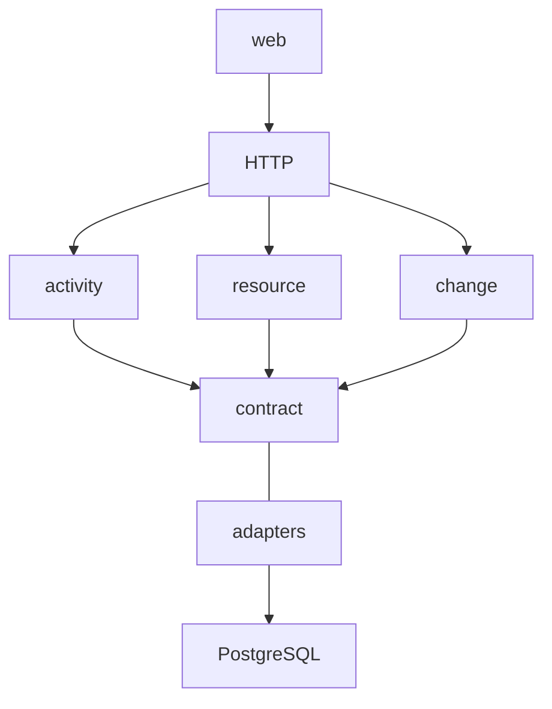
```mermaid
flowchart TB
 web-->HTTP
 HTTP-->activity
 HTTP-->resource
 HTTP-->change
 activity-->contract
 resource-->contract
 change-->contract
 contract---adapters
 adapters-->PostgreSQL
```

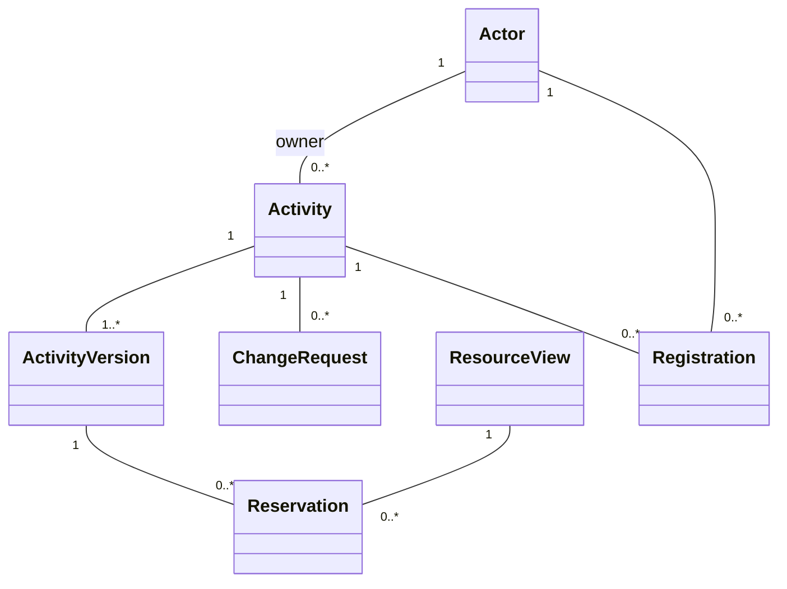
```mermaid
classDiagram
Activity "1" -- "1..*" ActivityVersion
Actor "1" -- "0..*" Activity : owner
Activity "1" -- "0..*" ChangeRequest
ActivityVersion "1" -- "0..*" Reservation
ResourceView "1" -- "0..*" Reservation
Actor "1" -- "0..*" Registration
Activity "1" -- "0..*" Registration
```

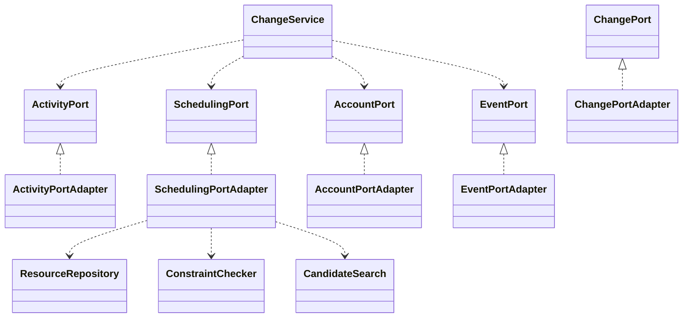
```mermaid
classDiagram
SchedulingPort <|.. SchedulingPortAdapter
ActivityPort <|.. ActivityPortAdapter
AccountPort <|.. AccountPortAdapter
ChangePort <|.. ChangePortAdapter
EventPort <|.. EventPortAdapter
ChangeService ..> ActivityPort
ChangeService ..> SchedulingPort
ChangeService ..> AccountPort
ChangeService ..> EventPort
SchedulingPortAdapter ..> ResourceRepository
SchedulingPortAdapter ..> ConstraintChecker
SchedulingPortAdapter ..> CandidateSearch
```

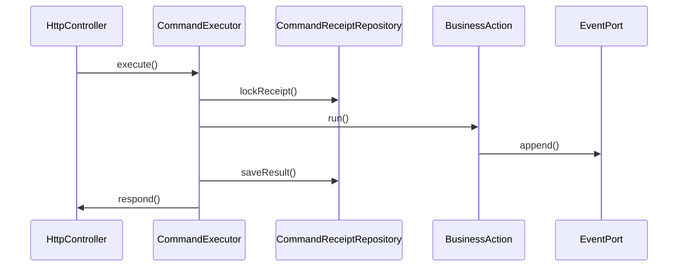
```mermaid
sequenceDiagram
 participant HttpController
 participant CommandExecutor
 participant CommandReceiptRepository
 participant BusinessAction
 participant EventPort
 HttpController->>CommandExecutor: execute()
 CommandExecutor->>CommandReceiptRepository: lockReceipt()
 CommandExecutor->>BusinessAction: run()
 BusinessAction->>EventPort: append()
 CommandExecutor->>CommandReceiptRepository: saveResult()
 CommandExecutor->>HttpController: respond()
```

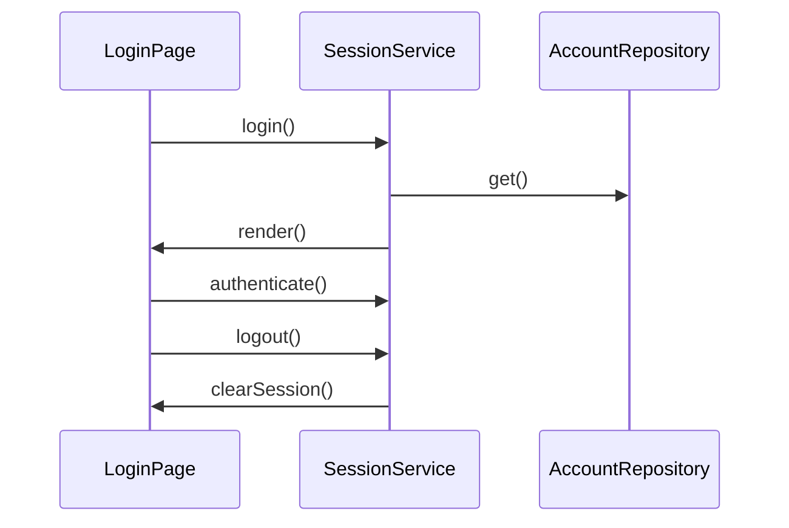
```mermaid
sequenceDiagram
 participant LoginPage
 participant SessionService
 participant AccountRepository
 LoginPage->>SessionService: login()
 SessionService->>AccountRepository: get()
 SessionService->>LoginPage: render()
 LoginPage->>SessionService: authenticate()
 LoginPage->>SessionService: logout()
 SessionService->>LoginPage: clearSession()
```

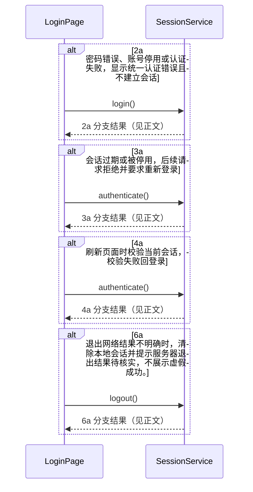
```mermaid
sequenceDiagram
 participant LoginPage
 participant SessionService
 alt 2a 密码错误、账号停用或认证失败，显示统一认证错误且不建立会话
 LoginPage->>SessionService: login()
 SessionService-->>LoginPage: 2a 分支结果（见正文）
 end
 alt 3a 会话过期或被停用，后续请求拒绝并要求重新登录
 LoginPage->>SessionService: authenticate()
 SessionService-->>LoginPage: 3a 分支结果（见正文）
 end
 alt 4a 刷新页面时校验当前会话，校验失败回登录
 LoginPage->>SessionService: authenticate()
 SessionService-->>LoginPage: 4a 分支结果（见正文）
 end
 alt 6a 退出网络结果不明确时，清除本地会话并提示服务器退出结果待核实，不展示虚假成功。
 LoginPage->>SessionService: logout()
 SessionService-->>LoginPage: 6a 分支结果（见正文）
 end
```

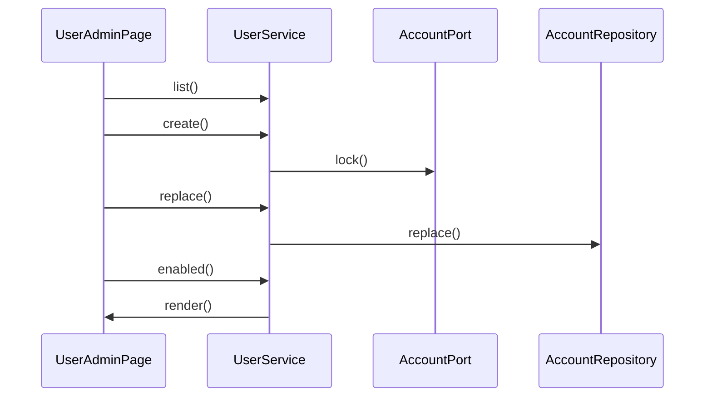
```mermaid
sequenceDiagram
 participant UserAdminPage
 participant UserService
 participant AccountPort
 participant AccountRepository
 UserAdminPage->>UserService: list()
 UserAdminPage->>UserService: create()
 UserService->>AccountPort: lock()
 UserAdminPage->>UserService: replace()
 UserService->>AccountRepository: replace()
 UserAdminPage->>UserService: enabled()
 UserService->>UserAdminPage: render()
```

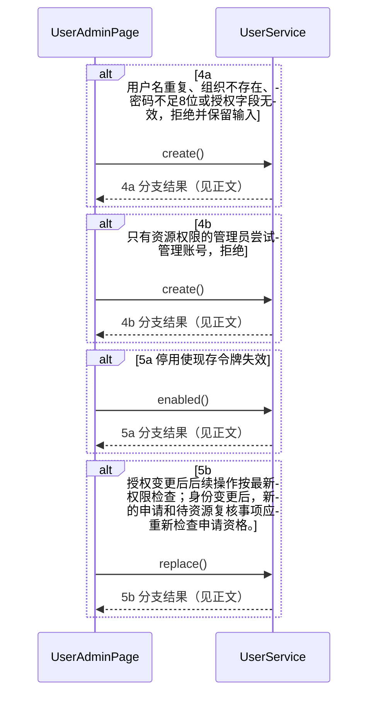
```mermaid
sequenceDiagram
 participant UserAdminPage
 participant UserService
 alt 4a 用户名重复、组织不存在、密码不足8位或授权字段无效，拒绝并保留输入
 UserAdminPage->>UserService: create()
 UserService-->>UserAdminPage: 4a 分支结果（见正文）
 end
 alt 4b 只有资源权限的管理员尝试管理账号，拒绝
 UserAdminPage->>UserService: create()
 UserService-->>UserAdminPage: 4b 分支结果（见正文）
 end
 alt 5a 停用使现存令牌失效
 UserAdminPage->>UserService: enabled()
 UserService-->>UserAdminPage: 5a 分支结果（见正文）
 end
 alt 5b 授权变更后后续操作按最新权限检查；身份变更后，新的申请和待资源复核事项应重新检查申请资格。
 UserAdminPage->>UserService: replace()
 UserService-->>UserAdminPage: 5b 分支结果（见正文）
 end
```

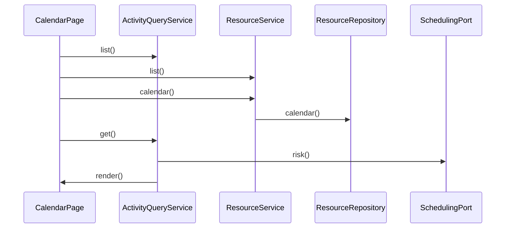
```mermaid
sequenceDiagram
 participant CalendarPage
 participant ActivityQueryService
 participant ResourceService
 participant ResourceRepository
 participant SchedulingPort
 CalendarPage->>ActivityQueryService: list()
 CalendarPage->>ResourceService: list()
 CalendarPage->>ResourceService: calendar()
 ResourceService->>ResourceRepository: calendar()
 CalendarPage->>ActivityQueryService: get()
 ActivityQueryService->>SchedulingPort: risk()
 ActivityQueryService->>CalendarPage: render()
```

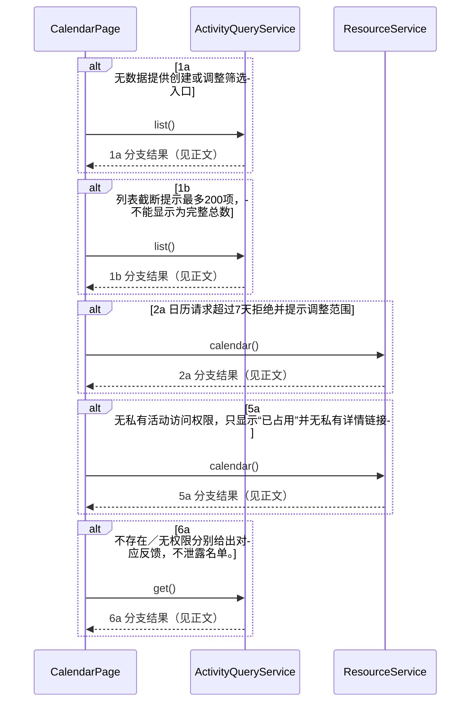
```mermaid
sequenceDiagram
 participant CalendarPage
 participant ActivityQueryService
 participant ResourceService
 alt 1a 无数据提供创建或调整筛选入口
 CalendarPage->>ActivityQueryService: list()
 ActivityQueryService-->>CalendarPage: 1a 分支结果（见正文）
 end
 alt 1b 列表截断提示最多200项，不能显示为完整总数
 CalendarPage->>ActivityQueryService: list()
 ActivityQueryService-->>CalendarPage: 1b 分支结果（见正文）
 end
 alt 2a 日历请求超过7天拒绝并提示调整范围
 CalendarPage->>ResourceService: calendar()
 ResourceService-->>CalendarPage: 2a 分支结果（见正文）
 end
 alt 5a 无私有活动访问权限，只显示“已占用”并无私有详情链接
 CalendarPage->>ResourceService: calendar()
 ResourceService-->>CalendarPage: 5a 分支结果（见正文）
 end
 alt 6a 不存在／无权限分别给出对应反馈，不泄露名单。
 CalendarPage->>ActivityQueryService: get()
 ActivityQueryService-->>CalendarPage: 6a 分支结果（见正文）
 end
```

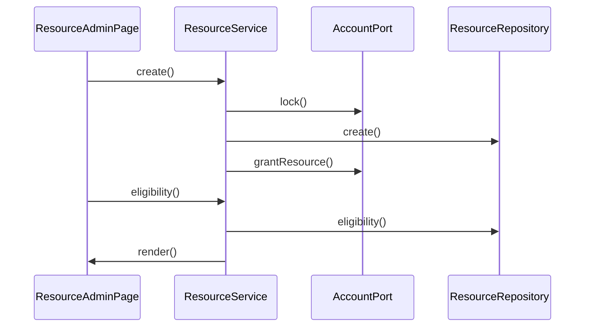
```mermaid
sequenceDiagram
 participant ResourceAdminPage
 participant ResourceService
 participant AccountPort
 participant ResourceRepository
 ResourceAdminPage->>ResourceService: create()
 ResourceService->>AccountPort: lock()
 ResourceService->>ResourceRepository: create()
 ResourceService->>AccountPort: grantResource()
 ResourceAdminPage->>ResourceService: eligibility()
 ResourceService->>ResourceRepository: eligibility()
 ResourceService->>ResourceAdminPage: render()
```

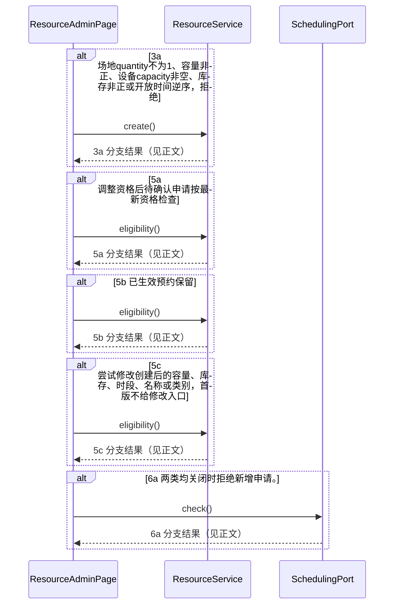
```mermaid
sequenceDiagram
 participant ResourceAdminPage
 participant ResourceService
 participant SchedulingPort
 alt 3a 场地quantity不为1、容量非正、设备capacity非空、库存非正或开放时间逆序，拒绝
 ResourceAdminPage->>ResourceService: create()
 ResourceService-->>ResourceAdminPage: 3a 分支结果（见正文）
 end
 alt 5a 调整资格后待确认申请按最新资格检查
 ResourceAdminPage->>ResourceService: eligibility()
 ResourceService-->>ResourceAdminPage: 5a 分支结果（见正文）
 end
 alt 5b 已生效预约保留
 ResourceAdminPage->>ResourceService: eligibility()
 ResourceService-->>ResourceAdminPage: 5b 分支结果（见正文）
 end
 alt 5c 尝试修改创建后的容量、库存、时段、名称或类别，首版不给修改入口
 ResourceAdminPage->>ResourceService: eligibility()
 ResourceService-->>ResourceAdminPage: 5c 分支结果（见正文）
 end
 alt 6a 两类均关闭时拒绝新增申请。
 ResourceAdminPage->>SchedulingPort: check()
 SchedulingPort-->>ResourceAdminPage: 6a 分支结果（见正文）
 end
```

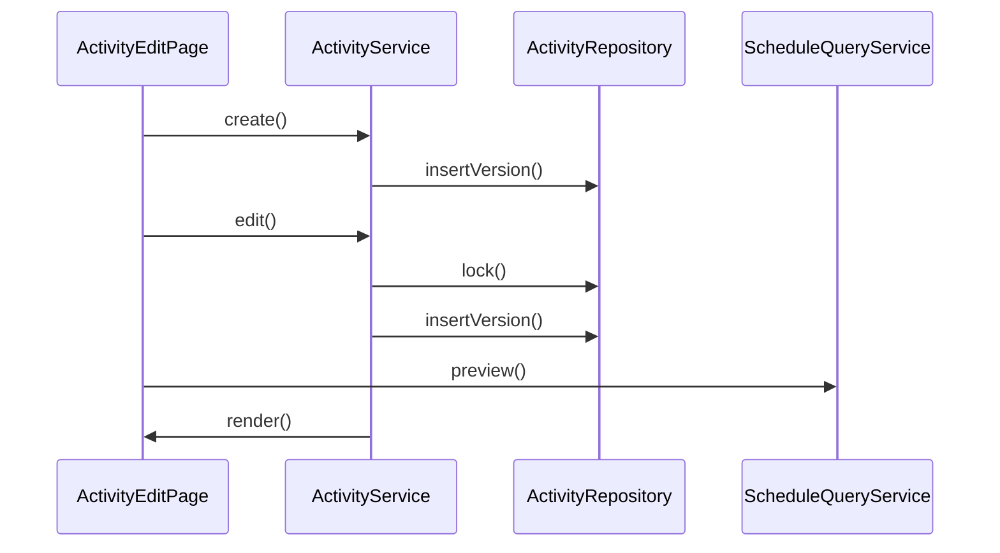
```mermaid
sequenceDiagram
 participant ActivityEditPage
 participant ActivityService
 participant ActivityRepository
 participant ScheduleQueryService
 ActivityEditPage->>ActivityService: create()
 ActivityService->>ActivityRepository: insertVersion()
 ActivityEditPage->>ActivityService: edit()
 ActivityService->>ActivityRepository: lock()
 ActivityService->>ActivityRepository: insertVersion()
 ActivityEditPage->>ScheduleQueryService: preview()
 ActivityService->>ActivityEditPage: render()
```

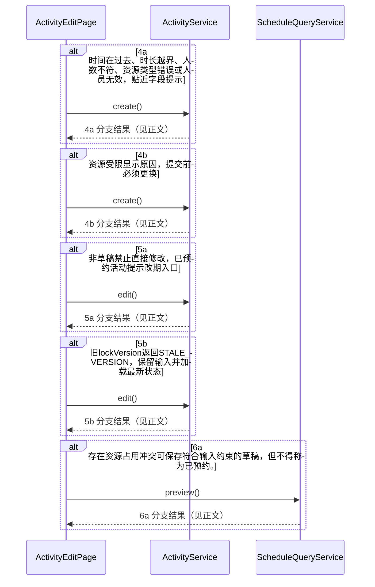
```mermaid
sequenceDiagram
 participant ActivityEditPage
 participant ActivityService
 participant ScheduleQueryService
 alt 4a 时间在过去、时长越界、人数不符、资源类型错误或人员无效，贴近字段提示
 ActivityEditPage->>ActivityService: create()
 ActivityService-->>ActivityEditPage: 4a 分支结果（见正文）
 end
 alt 4b 资源受限显示原因，提交前必须更换
 ActivityEditPage->>ActivityService: create()
 ActivityService-->>ActivityEditPage: 4b 分支结果（见正文）
 end
 alt 5a 非草稿禁止直接修改，已预约活动提示改期入口
 ActivityEditPage->>ActivityService: edit()
 ActivityService-->>ActivityEditPage: 5a 分支结果（见正文）
 end
 alt 5b 旧lockVersion返回STALE_VERSION，保留输入并加载最新状态
 ActivityEditPage->>ActivityService: edit()
 ActivityService-->>ActivityEditPage: 5b 分支结果（见正文）
 end
 alt 6a 存在资源占用冲突可保存符合输入约束的草稿，但不得称为已预约。
 ActivityEditPage->>ScheduleQueryService: preview()
 ScheduleQueryService-->>ActivityEditPage: 6a 分支结果（见正文）
 end
```

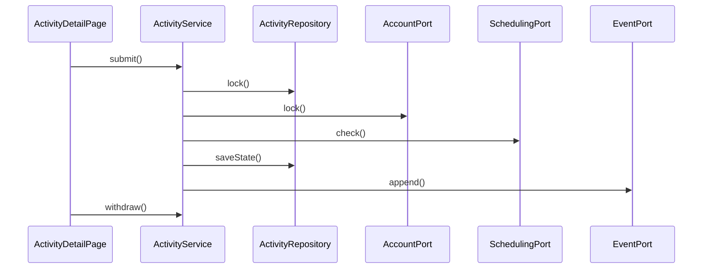
```mermaid
sequenceDiagram
 participant ActivityDetailPage
 participant ActivityService
 participant ActivityRepository
 participant AccountPort
 participant SchedulingPort
 participant EventPort
 ActivityDetailPage->>ActivityService: submit()
 ActivityService->>ActivityRepository: lock()
 ActivityService->>AccountPort: lock()
 ActivityService->>SchedulingPort: check()
 ActivityService->>ActivityRepository: saveState()
 ActivityService->>EventPort: append()
 ActivityDetailPage->>ActivityService: withdraw()
```

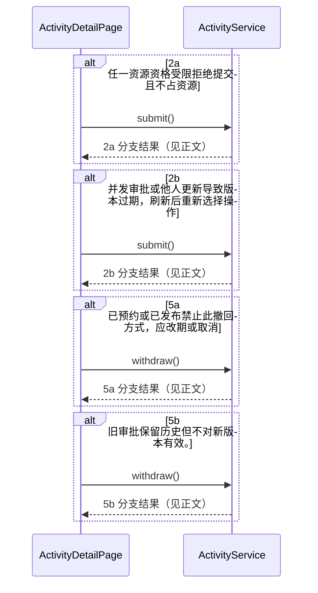
```mermaid
sequenceDiagram
 participant ActivityDetailPage
 participant ActivityService
 alt 2a 任一资源资格受限拒绝提交且不占资源
 ActivityDetailPage->>ActivityService: submit()
 ActivityService-->>ActivityDetailPage: 2a 分支结果（见正文）
 end
 alt 2b 并发审批或他人更新导致版本过期，刷新后重新选择操作
 ActivityDetailPage->>ActivityService: submit()
 ActivityService-->>ActivityDetailPage: 2b 分支结果（见正文）
 end
 alt 5a 已预约或已发布禁止此撤回方式，应改期或取消
 ActivityDetailPage->>ActivityService: withdraw()
 ActivityService-->>ActivityDetailPage: 5a 分支结果（见正文）
 end
 alt 5b 旧审批保留历史但不对新版本有效。
 ActivityDetailPage->>ActivityService: withdraw()
 ActivityService-->>ActivityDetailPage: 5b 分支结果（见正文）
 end
```

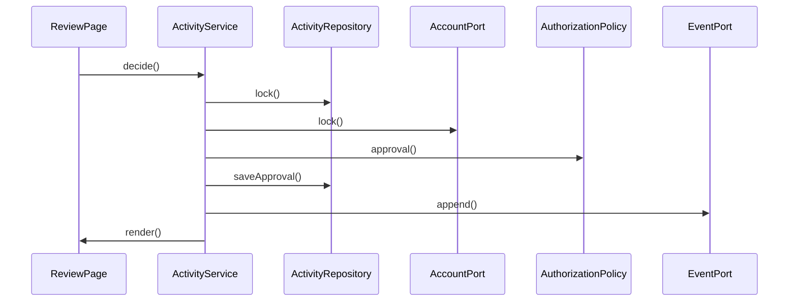
```mermaid
sequenceDiagram
 participant ReviewPage
 participant ActivityService
 participant ActivityRepository
 participant AccountPort
 participant AuthorizationPolicy
 participant EventPort
 ReviewPage->>ActivityService: decide()
 ActivityService->>ActivityRepository: lock()
 ActivityService->>AccountPort: lock()
 ActivityService->>AuthorizationPolicy: approval()
 ActivityService->>ActivityRepository: saveApproval()
 ActivityService->>EventPort: append()
 ActivityService->>ReviewPage: render()
```

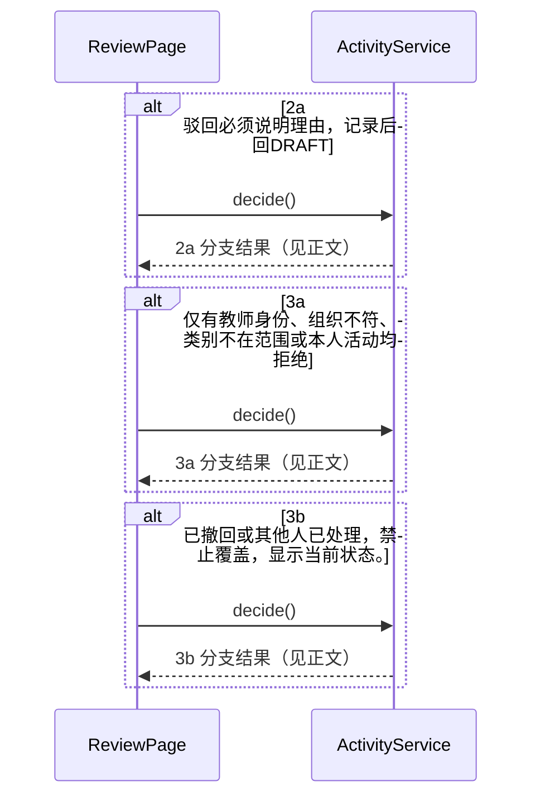
```mermaid
sequenceDiagram
 participant ReviewPage
 participant ActivityService
 alt 2a 驳回必须说明理由，记录后回DRAFT
 ReviewPage->>ActivityService: decide()
 ActivityService-->>ReviewPage: 2a 分支结果（见正文）
 end
 alt 3a 仅有教师身份、组织不符、类别不在范围或本人活动均拒绝
 ReviewPage->>ActivityService: decide()
 ActivityService-->>ReviewPage: 3a 分支结果（见正文）
 end
 alt 3b 已撤回或其他人已处理，禁止覆盖，显示当前状态。
 ReviewPage->>ActivityService: decide()
 ActivityService-->>ReviewPage: 3b 分支结果（见正文）
 end
```

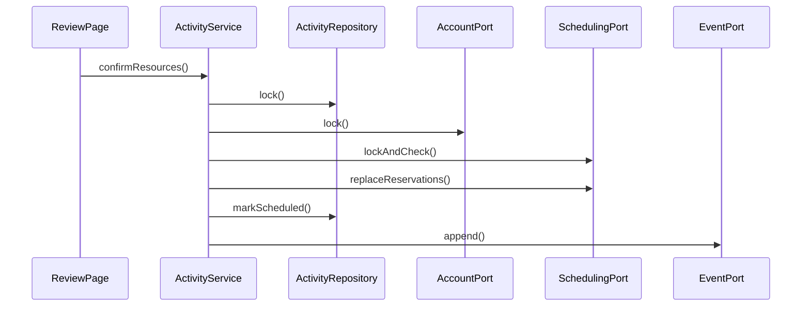
```mermaid
sequenceDiagram
 participant ReviewPage
 participant ActivityService
 participant ActivityRepository
 participant AccountPort
 participant SchedulingPort
 participant EventPort
 ReviewPage->>ActivityService: confirmResources()
 ActivityService->>ActivityRepository: lock()
 ActivityService->>AccountPort: lock()
 ActivityService->>SchedulingPort: lockAndCheck()
 ActivityService->>SchedulingPort: replaceReservations()
 ActivityService->>ActivityRepository: markScheduled()
 ActivityService->>EventPort: append()
```

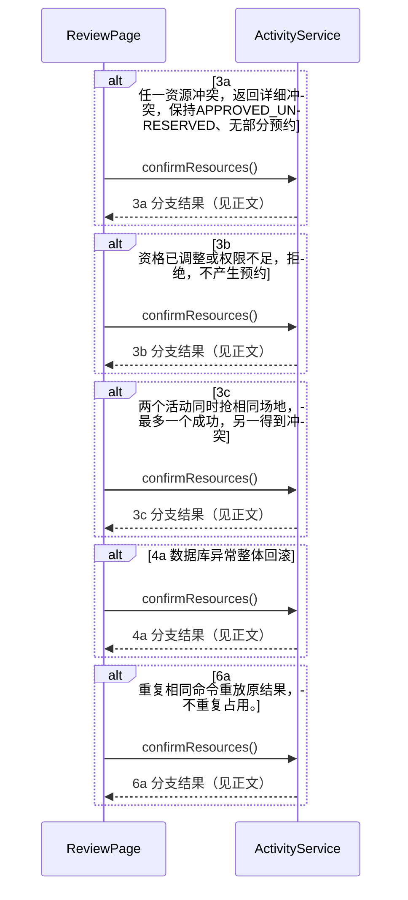
```mermaid
sequenceDiagram
 participant ReviewPage
 participant ActivityService
 alt 3a 任一资源冲突，返回详细冲突，保持APPROVED_UNRESERVED、无部分预约
 ReviewPage->>ActivityService: confirmResources()
 ActivityService-->>ReviewPage: 3a 分支结果（见正文）
 end
 alt 3b 资格已调整或权限不足，拒绝，不产生预约
 ReviewPage->>ActivityService: confirmResources()
 ActivityService-->>ReviewPage: 3b 分支结果（见正文）
 end
 alt 3c 两个活动同时抢相同场地，最多一个成功，另一得到冲突
 ReviewPage->>ActivityService: confirmResources()
 ActivityService-->>ReviewPage: 3c 分支结果（见正文）
 end
 alt 4a 数据库异常整体回滚
 ReviewPage->>ActivityService: confirmResources()
 ActivityService-->>ReviewPage: 4a 分支结果（见正文）
 end
 alt 6a 重复相同命令重放原结果，不重复占用。
 ReviewPage->>ActivityService: confirmResources()
 ActivityService-->>ReviewPage: 6a 分支结果（见正文）
 end
```

```mermaid
sequenceDiagram
 participant ActivityDetailPage
 participant ActivityService
 participant ActivityRepository
 participant AccountPort
 participant SchedulingPort
 participant EventPort
 ActivityDetailPage->>ActivityService: publish()
 ActivityService->>ActivityRepository: lock()
 ActivityService->>AccountPort: lock()
 ActivityService->>SchedulingPort: risk()
 ActivityService->>ActivityRepository: saveState()
 ActivityService->>EventPort: append()
 ActivityService->>ActivityDetailPage: render()
```

```mermaid
sequenceDiagram
 participant ActivityDetailPage
 participant ActivityService
 alt 3a 未确认资源、已开始、故障风险或无权限，拒绝并说明
 ActivityDetailPage->>ActivityService: publish()
 ActivityService-->>ActivityDetailPage: 3a 分支结果（见正文）
 end
 alt 3b 状态已变化，刷新后展示最新结果。
 ActivityDetailPage->>ActivityService: publish()
 ActivityService-->>ActivityDetailPage: 3b 分支结果（见正文）
 end
```

```mermaid
sequenceDiagram
 participant ActivityDetailPage
 participant RegistrationService
 participant ActivityPort
 participant ChangePort
 participant AccountPort
 participant RegistrationRepository
 ActivityDetailPage->>RegistrationService: change()
 RegistrationService->>ActivityPort: lock()
 RegistrationService->>ChangePort: hasPending()
 RegistrationService->>AccountPort: lock()
 RegistrationService->>RegistrationRepository: countActive()
 RegistrationService->>RegistrationRepository: save()
 RegistrationService->>ActivityPort: bumpLockVersion()
```

```mermaid
sequenceDiagram
 participant ActivityDetailPage
 participant RegistrationService
 alt 3a 满额为CAPACITY_FULL，不新增报名
 ActivityDetailPage->>RegistrationService: change()
 RegistrationService-->>ActivityDetailPage: 3a 分支结果（见正文）
 end
 alt 3b 20个不同学生抢1名额，恰1成功
 ActivityDetailPage->>RegistrationService: change()
 RegistrationService-->>ActivityDetailPage: 3b 分支结果（见正文）
 end
 alt 3c 待改期返回CHANGE_PENDING，说明冻结原因
 ActivityDetailPage->>RegistrationService: change()
 RegistrationService-->>ActivityDetailPage: 3c 分支结果（见正文）
 end
 alt 3d 有效版本已变返回STALE_VERSION，要求查看新安排后操作
 ActivityDetailPage->>RegistrationService: change()
 RegistrationService-->>ActivityDetailPage: 3d 分支结果（见正文）
 end
 alt 4a 本人已ACTIVE重复JOIN返回原记录
 ActivityDetailPage->>RegistrationService: change()
 RegistrationService-->>ActivityDetailPage: 4a 分支结果（见正文）
 end
 alt 6a 已WITHDRAWN重复退出返回原记录，无历史退出为INVALID_STATE
 ActivityDetailPage->>RegistrationService: change()
 RegistrationService-->>ActivityDetailPage: 6a 分支结果（见正文）
 end
 alt 6b 退出后重新报名需重新检查名额。
 ActivityDetailPage->>RegistrationService: change()
 RegistrationService-->>ActivityDetailPage: 6b 分支结果（见正文）
 end
```

```mermaid
sequenceDiagram
 participant ChangeWorkbenchPage
 participant ScheduleQueryService
 participant ActivityPort
 participant AccountPort
 participant SchedulingPort
 ChangeWorkbenchPage->>ScheduleQueryService: preview()
 ScheduleQueryService->>ActivityPort: get()
 ScheduleQueryService->>AccountPort: get()
 ScheduleQueryService->>SchedulingPort: check()
 ScheduleQueryService->>SchedulingPort: alternatives()
 ScheduleQueryService->>ChangeWorkbenchPage: render()
 ChangeWorkbenchPage->>ChangeWorkbenchPage: selectPlan()
```

```mermaid
sequenceDiagram
 participant ChangeWorkbenchPage
 participant ScheduleQueryService
 alt 2a 排除同一活动自身旧预约，不能误判自身为竞争者
 ChangeWorkbenchPage->>ScheduleQueryService: preview()
 ScheduleQueryService-->>ChangeWorkbenchPage: 2a 分支结果（见正文）
 end
 alt 4a 无方案时说明仅当前搜索范围未找到，引导人工调整
 ChangeWorkbenchPage->>ScheduleQueryService: preview()
 ScheduleQueryService-->>ChangeWorkbenchPage: 4a 分支结果（见正文）
 end
 alt 4b 候选不足300仍可返回，达预算截断要说明
 ChangeWorkbenchPage->>ScheduleQueryService: preview()
 ScheduleQueryService-->>ChangeWorkbenchPage: 4b 分支结果（见正文）
 end
 alt 4c 同类替换资源无申请资格应过滤
 ChangeWorkbenchPage->>ScheduleQueryService: preview()
 ScheduleQueryService-->>ChangeWorkbenchPage: 4c 分支结果（见正文）
 end
 alt 7a 选择不代表占位，不直接预约；目标有冲突仍可按BR-20创建改期，但页面必须持续提示最终复核风险。
 ChangeWorkbenchPage->>ScheduleQueryService: preview()
 ScheduleQueryService-->>ChangeWorkbenchPage: 7a 分支结果（见正文）
 end
```

```mermaid
sequenceDiagram
 participant ChangeWorkbenchPage
 participant ChangeService
 participant SchedulingPort
 participant ActivityPort
 participant AccountPort
 participant ChangeRepository
 participant EventPort
 ChangeWorkbenchPage->>ChangeService: preview()
 ChangeService->>SchedulingPort: check()
 ChangeWorkbenchPage->>ChangeService: create()
 ChangeService->>ActivityPort: lock()
 ChangeService->>AccountPort: lock()
 ChangeService->>ChangeRepository: insert()
 ChangeService->>ActivityPort: bumpLockVersion()
 ChangeService->>EventPort: append()
```

```mermaid
sequenceDiagram
 participant ChangeWorkbenchPage
 participant ChangeService
 alt 3a 选择了新备选必须重新计算，不能提交此前目标
 ChangeWorkbenchPage->>ChangeService: preview()
 ChangeService-->>ChangeWorkbenchPage: 3a 分支结果（见正文）
 end
 alt 6a 报名或其他操作导致lockVersion过期，返回STALE_VERSION并重新展示最新影响
 ChangeWorkbenchPage->>ChangeService: create()
 ChangeService-->>ChangeWorkbenchPage: 6a 分支结果（见正文）
 end
 alt 6b 已有改期或目标资源资格受限，拒绝
 ChangeWorkbenchPage->>ChangeService: create()
 ChangeService-->>ChangeWorkbenchPage: 6b 分支结果（见正文）
 end
 alt 6c 目标资源仍有冲突可创建，但应明确未占位、最终可能失败
 ChangeWorkbenchPage->>ChangeService: create()
 ChangeService-->>ChangeWorkbenchPage: 6c 分支结果（见正文）
 end
 alt 7a 数据库异常整体回滚，不遗留冻结。
 ChangeWorkbenchPage->>ChangeService: create()
 ChangeService-->>ChangeWorkbenchPage: 7a 分支结果（见正文）
 end
```

```mermaid
sequenceDiagram
 participant ChangeDetailPage
 participant ChangeService
 participant ActivityPort
 participant ChangeRepository
 participant AccountPort
 participant EventPort
 ChangeDetailPage->>ChangeService: confirm()
 ChangeService->>ActivityPort: lock()
 ChangeService->>ChangeRepository: lock()
 ChangeService->>AccountPort: lock()
 ChangeService->>ChangeRepository: saveConfirmation()
 ChangeService->>ActivityPort: bumpLockVersion()
 ChangeService->>EventPort: append()
```

```mermaid
sequenceDiagram
 participant ChangeDetailPage
 participant ChangeService
 alt 2a 拒绝需理由，改期REJECTED并解除冻结，原安排保留
 ChangeDetailPage->>ChangeService: confirm()
 ChangeService-->>ChangeDetailPage: 2a 分支结果（见正文）
 end
 alt 3a 重复相同决定返回当前结果，无重复事件
 ChangeDetailPage->>ChangeService: confirm()
 ChangeService-->>ChangeDetailPage: 3a 分支结果（见正文）
 end
 alt 3b 已决定后反向决定为ALREADY_DECIDED
 ChangeDetailPage->>ChangeService: confirm()
 ChangeService-->>ChangeDetailPage: 3b 分支结果（见正文）
 end
 alt 3c 非名单人员或替别人确认拒绝
 ChangeDetailPage->>ChangeService: confirm()
 ChangeService-->>ChangeDetailPage: 3c 分支结果（见正文）
 end
 alt 3d 活动已取消或申请已终结，不接受新决定。
 ChangeDetailPage->>ChangeService: confirm()
 ChangeService-->>ChangeDetailPage: 3d 分支结果（见正文）
 end
```

```mermaid
sequenceDiagram
 participant ReviewPage
 participant ChangeService
 participant ActivityPort
 participant ChangeRepository
 participant AccountPort
 participant AuthorizationPolicy
 participant EventPort
 ReviewPage->>ChangeService: decide()
 ChangeService->>ActivityPort: lock()
 ChangeService->>ChangeRepository: lock()
 ChangeService->>AccountPort: lock()
 ChangeService->>AuthorizationPolicy: approval()
 ChangeService->>ChangeRepository: saveDecision()
 ChangeService->>ActivityPort: bumpLockVersion()
 ChangeService->>EventPort: append()
```

```mermaid
sequenceDiagram
 participant ReviewPage
 participant ChangeService
 alt 2a 驳回并说明理由，REJECTED，原预约保留且解除冻结
 ReviewPage->>ChangeService: decide()
 ChangeService-->>ReviewPage: 2a 分支结果（见正文）
 end
 alt 3a 申请已撤回、被取消或越权，拒绝
 ReviewPage->>ChangeService: decide()
 ChangeService-->>ReviewPage: 3a 分支结果（见正文）
 end
 alt 4a 目标变化需要新申请，旧意见不能复用。
 ReviewPage->>ChangeService: decide()
 ChangeService-->>ReviewPage: 4a 分支结果（见正文）
 end
```

```mermaid
sequenceDiagram
 participant ReviewPage
 participant ChangeService
 participant ActivityPort
 participant ChangeRepository
 participant AccountPort
 participant SchedulingPort
 participant EventPort
 ReviewPage->>ChangeService: confirmResources()
 ChangeService->>ActivityPort: lock()
 ChangeService->>ChangeRepository: lock()
 ChangeService->>AccountPort: lock()
 ChangeService->>SchedulingPort: lockAndCheck()
 ChangeService->>ActivityPort: activatePlan()
 ChangeService->>SchedulingPort: replaceReservations()
 ChangeService->>ChangeRepository: markApplied()
 ChangeService->>EventPort: append()
```

```mermaid
sequenceDiagram
 participant ReviewPage
 participant ChangeService
 alt 2a 管理员拒绝并说明理由，REJECTED、原安排不变
 ReviewPage->>ChangeService: confirmResources()
 ChangeService-->>ReviewPage: 2a 分支结果（见正文）
 end
 alt 3a 预览后资源被抢占，持久化CONFLICTED及冲突，返回RESOURCE_CONFLICT，原版本和预约保留
 ReviewPage->>ChangeService: confirmResources()
 ChangeService-->>ReviewPage: 3a 分支结果（见正文）
 end
 alt 3b 最新资格不符，拒绝切换，说明受限资源及原因，原有效安排保留
 ReviewPage->>ChangeService: confirmResources()
 ChangeService-->>ReviewPage: 3b 分支结果（见正文）
 end
 alt 3c 取消已生效或基础版本过期，拒绝旧请求
 ReviewPage->>ChangeService: confirmResources()
 ChangeService-->>ReviewPage: 3c 分支结果（见正文）
 end
 alt 5a 任一步数据库异常，版本、预约、报名、改期、审计和outbox全部回滚
 ReviewPage->>ChangeService: confirmResources()
 ChangeService-->>ReviewPage: 5a 分支结果（见正文）
 end
 alt 7a 通知投递失败独立重试，不撤回已提交安排。
 ReviewPage->>ChangeService: confirmResources()
 ChangeService-->>ReviewPage: 7a 分支结果（见正文）
 end
```

```mermaid
sequenceDiagram
 participant ChangeDetailPage
 participant ChangeService
 participant ActivityPort
 participant ChangeRepository
 participant AccountPort
 participant EventPort
 ChangeDetailPage->>ChangeService: withdraw()
 ChangeService->>ActivityPort: lock()
 ChangeService->>ChangeRepository: lock()
 ChangeService->>AccountPort: lock()
 ChangeService->>ChangeRepository: markWithdrawn()
 ChangeService->>ActivityPort: bumpLockVersion()
 ChangeService->>EventPort: append()
```

```mermaid
sequenceDiagram
 participant ChangeDetailPage
 participant ChangeService
 alt 3a 已生效／已拒绝／已冲突等终态不能撤回，提示当前状态
 ChangeDetailPage->>ChangeService: withdraw()
 ChangeService-->>ChangeDetailPage: 3a 分支结果（见正文）
 end
 alt 3b 与最终确认并发时以一致性检查后的状态处理，不撤销已提交的新安排。
 ChangeDetailPage->>ChangeService: withdraw()
 ChangeService-->>ChangeDetailPage: 3b 分支结果（见正文）
 end
```

```mermaid
sequenceDiagram
 participant ActivityDetailPage
 participant ActivityService
 participant ActivityRepository
 participant ChangePort
 participant AccountPort
 participant SchedulingPort
 participant RegistrationRepository
 participant EventPort
 ActivityDetailPage->>ActivityService: cancel()
 ActivityService->>ActivityRepository: lock()
 ActivityService->>ChangePort: cancelPending()
 ActivityService->>AccountPort: lock()
 ActivityService->>SchedulingPort: releaseReservations()
 ActivityService->>RegistrationRepository: cancelActive()
 ActivityService->>ActivityRepository: saveState()
 ActivityService->>EventPort: append()
```

```mermaid
sequenceDiagram
 participant ActivityDetailPage
 participant ActivityService
 opt 2a 用户放弃
 Note over ActivityDetailPage: 不发送取消命令
 end
 alt 3a 其他人取消或已开始拒绝
 ActivityDetailPage->>ActivityService: cancel()
 ActivityService-->>ActivityDetailPage: 3a 分支结果（见正文）
 end
 alt 4a 与改期最终确认竞争，最终取消不得被旧请求恢复，不能残留预约或待改期
 ActivityDetailPage->>ActivityService: cancel()
 ActivityService-->>ActivityDetailPage: 4a 分支结果（见正文）
 end
 alt 4b 合法所有者再次取消返回当前结果，不增加释放和通知
 ActivityDetailPage->>ActivityService: cancel()
 ActivityService-->>ActivityDetailPage: 4b 分支结果（见正文）
 end
 alt 4c 执行异常整体回滚，可检查后重试。
 ActivityDetailPage->>ActivityService: cancel()
 ActivityService-->>ActivityDetailPage: 4c 分支结果（见正文）
 end
```

```mermaid
sequenceDiagram
 participant ResourceAdminPage
 participant ResourceService
 participant AccountPort
 participant ResourceRepository
 participant SchedulingPort
 participant EventPort
 ResourceAdminPage->>ResourceService: fault()
 ResourceService->>AccountPort: lock()
 ResourceService->>ResourceRepository: lock()
 ResourceService->>ResourceRepository: addFault()
 ResourceService->>SchedulingPort: risk()
 ResourceService->>EventPort: append()
 ResourceService->>ResourceAdminPage: render()
```

```mermaid
sequenceDiagram
 participant ResourceAdminPage
 participant ResourceService
 alt 2a 数量≤0、超过库存或场地数量不是1，拒绝
 ResourceAdminPage->>ResourceService: fault()
 ResourceService-->>ResourceAdminPage: 2a 分支结果（见正文）
 end
 alt 4a 无受影响活动展示空清单
 ResourceAdminPage->>ResourceService: fault()
 ResourceService-->>ResourceAdminPage: 4a 分支结果（见正文）
 end
 alt 4b 重叠故障可用量最低0
 ResourceAdminPage->>ResourceService: fault()
 ResourceService-->>ResourceAdminPage: 4b 分支结果（见正文）
 end
 alt 5a 普通用户日历只见“资源不可用”而非私有原因
 ResourceAdminPage->>ResourceService: fault()
 ResourceService-->>ResourceAdminPage: 5a 分支结果（见正文）
 end
 alt 6a 后续改期失败，原预约仍保留风险。
 ResourceAdminPage->>ResourceService: fault()
 ResourceService-->>ResourceAdminPage: 6a 分支结果（见正文）
 end
```

```mermaid
sequenceDiagram
 participant NotificationPage
 participant NotificationService
 participant NotificationRepository
 participant ActivityQueryService
 NotificationPage->>NotificationService: list()
 NotificationService->>NotificationRepository: listByRecipient()
 NotificationPage->>NotificationService: markRead()
 NotificationService->>NotificationRepository: markRead()
 NotificationService->>NotificationPage: render()
 NotificationPage->>ActivityQueryService: get()
```

```mermaid
sequenceDiagram
 participant NotificationPage
 participant NotificationService
 alt 1a 无通知展示空状态
 NotificationPage->>NotificationService: list()
 NotificationService-->>NotificationPage: 1a 分支结果（见正文）
 end
 alt 3a 他人通知拒绝访问
 NotificationPage->>NotificationService: markRead()
 NotificationService-->>NotificationPage: 3a 分支结果（见正文）
 end
 alt 4a 重复已读不改变审批或确认
 NotificationPage->>NotificationService: markRead()
 NotificationService-->>NotificationPage: 4a 分支结果（见正文）
 end
 alt 5a 权限已变化或对象不可访问，解释原因，不因消息跳转绕过授权；消息尚未送达时可刷新，不能伪造通知列表。
 NotificationPage->>NotificationService: list()
 NotificationService-->>NotificationPage: 5a 分支结果（见正文）
 end
```

```mermaid
sequenceDiagram
 participant ActivityDetailPage
 participant ActivityQueryService
 participant RegistrationService
 participant AuditService
 participant ChangeService
 participant AuditRepository
 ActivityDetailPage->>ActivityQueryService: get()
 ActivityDetailPage->>RegistrationService: list()
 ActivityDetailPage->>AuditService: list()
 ActivityDetailPage->>ChangeService: list()
 AuditService->>AuditRepository: listByActivity()
 ActivityQueryService->>ActivityDetailPage: render()
```

```mermaid
sequenceDiagram
 participant ActivityDetailPage
 participant RegistrationService
 participant ChangeService
 participant AuditService
 alt 2a 普通学生只看本人报名，不能请求全名单
 ActivityDetailPage->>RegistrationService: list()
 RegistrationService-->>ActivityDetailPage: 2a 分支结果（见正文）
 end
 alt 2b 工作人员只看到确认所需内容
 ActivityDetailPage->>ChangeService: list()
 ChangeService-->>ActivityDetailPage: 2b 分支结果（见正文）
 end
 alt 3a 列表达到200项提示截断，人数使用真实计数
 ActivityDetailPage->>RegistrationService: list()
 RegistrationService-->>ActivityDetailPage: 3a 分支结果（见正文）
 end
 alt 4a 无记录说明尚无操作，不能展示示例为真实历史。
 ActivityDetailPage->>AuditService: list()
 AuditService-->>ActivityDetailPage: 4a 分支结果（见正文）
 end
```
