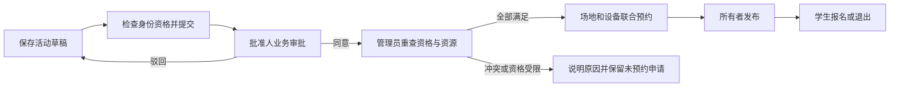
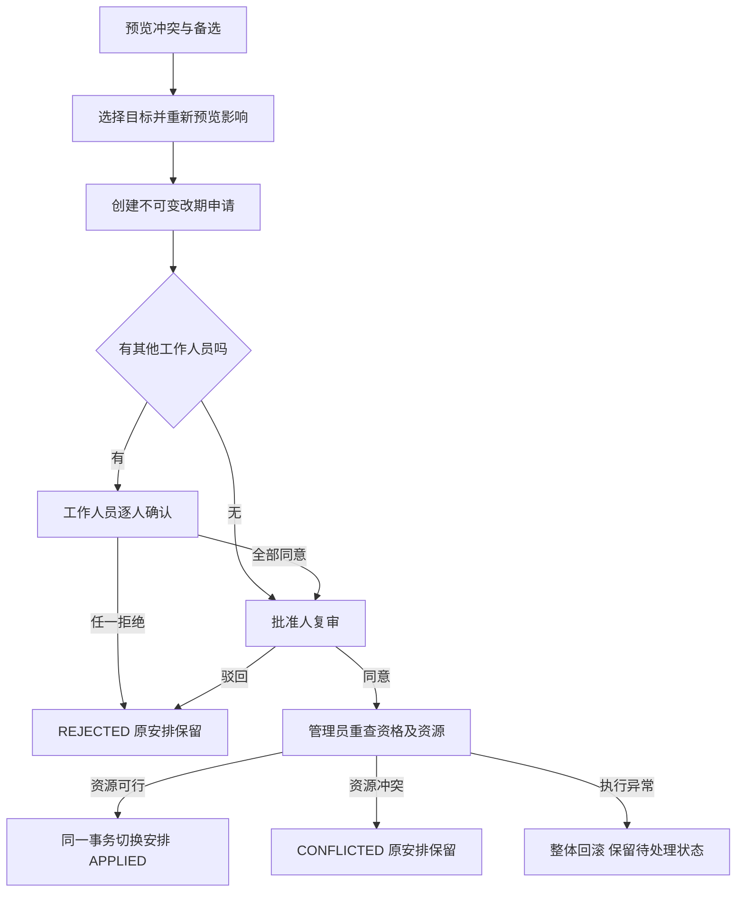

# 校园活动协同与资源调度系统软件需求规约

课程：软件综合实践

项目原选题：面向校园活动的多资源协同调度与变更影响分析系统

版本：v1.1

编制日期：2026年10月9日

项目性质：六人协作课程设计

责任岗位：系统分析员

## 目录

1. 引言
2. 系统概述
3. 用户角色与权限
4. 功能需求
5. 数据要求
6. 业务流程与状态
7. 外部接口与界面要求
8. 验收要求
9. 需求管理与追踪

## 1 引言

### 1.1 编写目的

本规约规定系统应向申请人、批准人和管理员提供的功能、业务限制及质量要求，供项目组开展设计、编码、测试和课程评审使用。系统以活动申请为主线，将审批、场地与设备预约、报名、改期、取消和通知关联起来，重点保证资源联合预约和变更处理的一致性。

本规约由以下相互引用的文件组成，阅读时应将其作为一套需求材料：

| 文件 | 内容 |
| --- | --- |
| 本文 | 系统范围、角色、功能需求、数据、状态和验收总则 |
| [用例规约](use-cases.md) | UC-01～UC-20的参与者、前置条件、基本流程、替代和异常流程及后置条件 |
| [补充规约](supplementary-specification.md) | 安全、可靠性、性能、可用性、运行环境和实现约束 |
| [业务规则](business-rules.md) | 权限、资格、时间、资源、版本和一致性规则 |
| [需求追踪矩阵](traceability.md) | 需求、用例、页面、接口和验收场景之间的对应关系 |

### 1.2 编制依据

本规约依据课程项目选题说明、项目考核评估表、小组角色分配及成员角色确认材料，结合[软件开发计划](../management/initial-project-plan.md)和项目的业务流程、数据接口及界面设计要求编制。

系统采用申请人、批准人和管理员三类角色，并以教师、学生身份判断具体资源的申请资格。本文使用“应”表述需要满足的要求，供设计和测试确定相应实现及检查方法。所述审批、资格和调度规则为本课程项目的产品要求。

### 1.3 术语

| 术语 | 定义 |
| --- | --- |
| 申请人 | 有权创建活动的账号；活动创建者是该活动所有者，承担组织职责 |
| 身份 | 账号的教师或学生属性，用于判断资源申请资格，与角色授权分别保存 |
| 批准人 | 在授权组织和资源类别范围内执行业务审批的账号 |
| 管理员 | 经具体权限授权，维护账号或资源，或者执行资源最终复核的账号 |
| 工作人员 | 由活动所有者指定的本组织启用账号，通过活动成员关系获得本人确认权限 |
| 联合预约 | 场地及全部设备同时预约成功，任一资源不满足时均不产生部分占用 |
| 当前版本 | 最新活动内容版本，使用versionNo标识，内容写入后不可修改 |
| 有效版本 | 已形成资源预约的活动安排，使用effectiveVersionNo标识 |
| 并发版本 | lockVersion，用于检测读取后记录是否已变化，不等同于内容版本 |
| 预览 | 只计算约束及影响，不占用资源，不保证最终确认时仍可行 |
| 原子切换 | 一次事务完成新版本、旧预约释放、新预约、报名版本、改期及事件的更新 |
| 资源风险 | NORMAL或AT_RISK；已有预约受故障影响时提示风险，保留原记录 |

## 2 系统概述

### 2.1 背景与目标

校园讲座、竞赛和社团活动需要同时协调场地、设备、人员及审批。单独处理各类资源会造成活动已获批但资源不足、布撤场冲突、改期后人员和报名信息未同步等问题。系统应帮助用户判断申请资格与资源可用性，解释冲突，比较备选安排，并在完成必要确认后统一更新安排。

### 2.2 产品范围

首版应包括账号权限、具体资源身份资格、活动申请、业务审批、资源日历、资源联合预约、冲突与有限范围备选方案、学生报名及退出、改期影响分析、工作人员确认、改期复审、资源最终复核、取消、故障、站内通知及操作审计。

首版不包含候补递补、签到、设备归还验收、自动人员排班、通用任务看板、统计报表、校园统一身份认证、短信、支付和硬件接入。备选调度只在规定候选范围内搜索，不承诺全局最优。系统面向一个校园和多个组织，课程部署采用一个演示实例。

### 2.3 运行与开发约束

系统通过中文浏览器界面访问，后端统一执行权限、资格和业务检查；数据库保存业务状态，页面刷新与服务重启后结果仍可查询。开发周期为5周；课程六个岗位是团队分工，与软件角色不同。技术和部署要求见补充规约。

## 3 用户角色与权限

### 3.1 角色职责

| 角色或业务关系 | 操作范围 | 限制 |
| --- | --- | --- |
| 申请人 | 创建和管理本人活动、查询资源、选择方案、发起改期、发布和取消 | 不能编辑他人活动；资源资格按其账号身份检查 |
| 学生身份申请人 | 浏览公开活动、报名和退出、查询本人参与历史 | 无权读取其他报名者名单；报名只针对本人 |
| 批准人 | 查看授权待办，批准或驳回活动及改期，查询审核所需记录 | 组织与资源类别均需满足授权范围；不得审批本人活动 |
| 管理员 | 按权限维护账号、身份、角色、授权范围、资源资格、故障和运行记录 | 账号管理权限不自动带来业务审批或资源确认权限 |
| 有资源确认权限的管理员 | 首次联合预约、改期资源最终复核 | 仅处理管理范围内资源；不得复核本人活动 |
| 指定工作人员 | 查看对应安排及影响，确认或拒绝本人待办 | 无权代替他人确认；名单按职责裁剪 |
| 报名人员 | 查询本人记录，接收改期与取消通知 | 不属于改期必须同意的对象 |

一个账号可兼具多个角色，但每项操作应分别核对启用状态、角色、授权范围、所有权和业务状态。教师身份不自动获得批准权限。工作人员和报名人员是活动关系，不新增系统角色。

### 3.2 数据可见范围

所有登录用户可浏览OPEN活动的公开信息和资源占用情况。本人所有、本人作为工作人员参与、本人有报名历史的活动按关系提供详情。私有活动在无权查看者的日历中只显示“已占用”、资源、时间和风险，不显示标题、所有者或名单。

完整报名名单、审批意见、改期通知名单及审计仅向活动所有者或履行当前职责所必需的批准人、管理员开放。普通学生只看到本人报名状态；工作人员查看改期时可见真实受影响人数及本人确认事项，不能获得全部报名者、通知收件人ID。个人通知只向收件人本人提供。

### 3.3 资源申请资格

每个资源应独立设置是否允许教师申请、是否允许学生申请，可组合为两者允许、仅教师、仅学生和两者禁止四种情况。活动主场地和每项设备均应满足所有者身份资格。系统应在提交、备选生成、改期创建和最终资源确认时校验最新资格；预览也应提示受限原因。

资格调整后，已生效预约保留；尚未完成资源确认的申请按最新资格处理。已有活动再次改期时，对目标资源重新检查。资格变更应留存操作者、时间及变更内容。各资源的申请资格由授权管理员根据资源用途分别设置。

## 4 功能需求

以下需求均为首版必须项。对应详细场景和验收见用例规约与追踪矩阵。

| 编号 | 名称 | 系统应满足的行为 |
| --- | --- | --- |
| FR-01 | 登录与会话 | 验证启用账号及密码，建立有有效期的会话；退出、过期或停用后拒绝旧会话 |
| FR-02 | 账号与授权管理 | 授权管理员创建账号，维护教师／学生身份、角色、启停状态、审批和资源管理范围；修改留存记录 |
| FR-03 | 权限与隐私 | 每次读写检查角色、关系及范围；禁止本人审批和本人资源复核；按职责裁剪返回内容 |
| FR-04 | 资源资料 | 查询或新增场地及设备，记录类别、容量、库存、开放时段；首版创建后不开放基本资料修改 |
| FR-05 | 资源身份资格 | 管理员按资源维护四种资格组合；前端提示及后端校验一致，不能通过直接请求或替换方案绕过 |
| FR-06 | 资源日历 | 按日期及资源展示布场、活动、撤场、设备同时用量和故障；查询区间最多7天 |
| FR-07 | 活动草稿 | 创建、查看和编辑本人草稿；保存完整内容并形成不可变新版本；校验时间、人数、资源及人员 |
| FR-08 | 提交与撤回 | 提交冻结当前内容，进入待业务审批且不占资源；撤回待审批或已审批未预约申请时克隆新草稿版本 |
| FR-09 | 活动业务审批 | 批准人处理授权版本，保存决定、意见、操作者和时间；同意进入资源待确认，驳回回草稿 |
| FR-10 | 首次联合预约 | 管理员重新检查最新资格及全部硬约束，可行才完整预约；失败保留已审批未预约状态且无部分占用 |
| FR-11 | 发布与活动查询 | 仅所有者发布已预约、尚未开始且无资源风险的活动；提供本人／公开／审核范围列表和详情 |
| FR-12 | 报名与退出 | 学生身份账号对本人执行报名和退出；检查开放状态、开始时间、有效版本、改期冻结及名额；重复不增加人数 |
| FR-13 | 报名名单 | 所有者及必要授权人员查询名单；普通参与者只查询本人记录；计数以ACTIVE为准 |
| FR-14 | 约束与冲突解释 | 检查容量、开放时段、场地互斥、设备峰值和故障，输出资源、精确区间、需求、可用数及中文原因 |
| FR-15 | 备选方案 | 按固定搜索范围生成符合身份资格的方案，最多检查300组，去重后按规定偏好排序，返回最多5项及搜索说明 |
| FR-16 | 改期影响预览 | 对比当前有效安排和目标，列资源增减与保留、审批重置、工作人员、报名人数及通知影响，不写预约 |
| FR-17 | 改期申请管理 | 仅所有者为未开始的已预约或已发布活动申请改期；冻结目标与影响快照；每活动最多一个待处理申请，可撤回 |
| FR-18 | 工作人员确认 | 除所有者本人外，指定工作人员逐人确认；全部同意进入复审，任一拒绝结束本次改期，不能代签 |
| FR-19 | 改期复审 | 批准人对确定目标独立复审；意见绑定改期，不能复用至其他目标；同意后进入资源待确认 |
| FR-20 | 改期资源切换 | 管理员最终重查，成功时原子切换版本、预约和有效报名版本；冲突保留原安排并记录CONFLICTED；异常整体回滚 |
| FR-21 | 活动取消 | 所有者在活动开始前取消；同时关闭待处理改期、释放全部有效预约、取消有效报名、保存事件和通知收件人快照 |
| FR-22 | 故障与风险 | 管理员登记故障时段、数量和原因，查询受影响活动；保留预约并显示AT_RISK，不自动取消或强制改期 |
| FR-23 | 站内通知 | 为提交、审批、改期、取消等事件生成对应通知，支持本人列表、未读筛选和已读；失败可重试，重复投递去重 |
| FR-24 | 历史与审计 | 保存活动版本、审批、预约释放、改期决定、取消、资格调整等历史；记录操作者、时间、对象和关联版本 |
| FR-25 | 重复与并发保护 | 相同命令重放原结果，不重复预约、报名或通知；旧版本不得覆盖新状态；并发不超额、取消后不复活 |

## 5 数据要求

### 5.1 主要信息

| 信息对象 | 必须保存或提供的信息 |
| --- | --- |
| 组织、账号与授权 | 组织、用户名、显示名、密码哈希、启用状态、身份、角色、审批及管理范围；身份与角色分别保存 |
| 资源及资格 | 标识、名称、类型、类别、容量或库存、开放时段、教师／学生申请许可及变更记录 |
| 活动与版本 | 所有者、组织、状态、内容版本、有效版本、并发版本、每版完整内容、创建者及时间 |
| 活动内容 | 标题、公开简介、预计人数、报名容量、工作人员、起止时间、布撤场时长、一个主场地及设备需求 |
| 审批 | 对应活动版本或改期ID、决定、意见、批准人及时间 |
| 预约与故障 | 对应资源、活动版本、完整占用时段、数量及状态；故障时段、不可用数量、原因及登记人 |
| 报名 | 活动与用户唯一关系、ACTIVE／WITHDRAWN／CANCELLED状态、当前有效安排版本 |
| 改期与确认 | 基础版本、不可变目标、原因、影响快照、状态、各确认与审批记录、冲突、已生效版本 |
| 通知与事件 | 事件、收件人、活动及版本、内容、读取时间、投递状态、次数及错误 |
| 审计与命令回执 | 操作者、事件、对象、版本、摘要及时间；命令键、请求摘要及原响应 |

### 5.2 校验要求

标题1～100字，简介最多2000字，改期／撤回／取消原因和审批意见最多1000字，拒绝和取消理由至少1字。预计人数不小于报名容量，报名容量至少1；场地容量不小于预计人数。工作人员应为本组织启用账号且去重。

活动时长30分钟～6小时，布场和撤场分别0～120分钟，时间精确到分钟。保存的新建或编辑计划、改期目标开始时间应在未来。设备数量为正整数，计划中同一设备资源不得重复出现；替换设备类别一致、数量不变。更多区间及故障规则见业务规则BR-06～BR-10。

### 5.3 版本、派生信息与保留

活动编辑、撤回和成功改期产生新内容版本；活动状态或报名等变化应更新并发版本。审批绑定其实际审核内容；历史版本不覆盖。资源风险和报名人数按当前记录计算；影响快照反映创建时刻，页面另查询实时风险。已释放预约、退出报名和终结改期保留历史。历史记录应支持按活动和版本查询，归档及清理应按数据管理要求执行。

## 6 业务流程与状态

### 6.1 首次申请

F节点中的资格失败不应写入预约；申请人需要变更内容时，应撤回形成新草稿再提交，不能复用旧内容审批。

| 当前状态标识 | 中文含义 | 可导致状态变化的操作 |
| --- | --- | --- |
| DRAFT | 草稿 | 编辑产生新版本；提交→PENDING_TEACHER |
| PENDING_TEACHER | 待业务审批 | 同意→APPROVED_UNRESERVED；驳回→DRAFT；撤回→新版本DRAFT |
| APPROVED_UNRESERVED | 已审批待资源确认 | 联合预约成功→SCHEDULED；冲突保持；撤回→新版本DRAFT |
| SCHEDULED | 已预约 | 发布→OPEN；可经改期切换有效安排并保持状态 |
| OPEN | 已发布开放报名 | 报名、退出；可经改期切换有效安排并保持状态 |
| CANCELLED | 已取消 | 终态，不得被旧审批或改期请求恢复 |

非CANCELLED状态且活动未开始时，所有者可以取消。待业务审批和待业务复审均要求批准人具有相应授权；教师身份与批准权限分别管理。

### 6.2 改期处理

最终复核时，资格受限或授权失效应拒绝资源切换并说明原因。申请人可根据当前状态撤回申请、调整目标后重新提交；失败处理应保护原有效安排。

| 改期状态 | 含义与规则 |
| --- | --- |
| AWAITING_CONFIRMATIONS | 等待工作人员确认，任一拒绝→REJECTED，全部同意→PENDING_TEACHER |
| PENDING_TEACHER | 待业务复审；同意→PENDING_RESOURCE，拒绝→REJECTED |
| PENDING_RESOURCE | 待资源最终复核；通过→APPLIED，拒绝→REJECTED，资源冲突→CONFLICTED |
| APPLIED | 已生效，关联新有效版本 |
| REJECTED | 被工作人员、批准人或资源复核管理员拒绝，保留原因 |
| CONFLICTED | 最终资源检查冲突，本申请不能再次生效，需重新预览和新建 |
| WITHDRAWN | 所有者撤回待处理改期 |
| CANCELLED_BY_ACTIVITY | 活动取消导致改期关闭 |

前三种为待处理状态，应冻结该活动的报名和退出；进入终态后按活动状态恢复。取消始终可以覆盖待处理改期。改期只调整时间、布撤场、主场地和设备，不改变名称、人数、报名容量和工作人员。

## 7 外部接口与界面要求

系统通过HTTP接口交换JSON数据，接口使用`/api/v1`前缀，统一请求、响应和错误结构。接口应覆盖认证、账号授权、资源资格、活动、审批、调度、报名、改期、通知和记录查询，并保持字段含义与业务规则一致。

登录外业务接口要求认证，健康检查例外；持久化写操作要求幂等键，登录／退出和只读预览例外。未登录401、越权403、不存在404、校验400、状态／资源冲突409、内部错误500。失败响应不包含SQL、堆栈或凭据。

用户界面应覆盖登录、活动列表、活动表单、活动详情、资源日历、资源管理、改期工作台、改期详情、审批待办、通知和账号管理。重点呈现日历占用、冲突方案对比、变更差异与影响、确认时间线。具体示意见[用户界面说明](../ui/interface-description.md)。界面中的审批状态、资源状态、报名状态和资源风险应分别表达，按钮按角色和状态呈现并说明禁用原因。

## 8 验收要求

验收应依据功能需求和用例检查正常、边界及异常结果。检查范围包括登录和授权、身份申请资格、首次预约、资源时间与数量约束、冲突及备选方案、报名、改期、取消、通知、历史查询、界面操作和持久化。

| 验收方面 | 主要场景 | 应达到的结果 |
| --- | --- | --- |
| 角色与资源资格 | 三角色授权、教师与学生身份、四种资源资格、自审及本人资源复核 | 操作符合角色和范围，所有资源均满足申请人身份资格，禁止本人审批和资源复核 |
| 活动生命周期 | 草稿、提交、驳回、撤回、批准、资源确认和发布 | 状态转换正确，版本和审批内容一致，首次资源确认前无有效预约 |
| 联合预约 | 场地可用但设备不足、两活动竞争场地、布撤场重叠及设备错峰 | 全部资源同时成功或失败，资源不超额，冲突原因和区间正确 |
| 报名 | 20名学生同时竞争1个名额、重复报名、退出及改期期间操作 | 恰1条有效报名，重复不增人数，退出释放名额，待处理改期期间冻结报名及退出 |
| 改期 | 工作人员确认、复审、最终复核、预览后资源被占、异常中断 | 成功时统一切换版本及预约，失败保护原安排，执行异常整体回滚 |
| 取消 | 重复取消及取消与改期确认同时发生 | 无有效预约、报名和待处理改期，旧请求不得恢复活动 |
| 故障与通知 | 故障影响、通知投递失败及重复投递、已读操作 | 风险明确，通知可重试且不重复，已读不替代确认 |
| 运行与界面 | 页面刷新、服务重启、不同视口和干净环境启动 | 已保存信息一致，主要操作可完成，错误原因清楚，部署及文档对应 |

验收依据和需求之间的对应关系见[需求追踪矩阵](traceability.md)。测试报告应记录环境、输入、步骤、期望和实际结果，附必要证据；本规约规定验收要求，不提供产品测试结果。

## 9 需求管理与追踪

需求按功能需求、补充需求、业务规则和用例分别编号，并与界面、设计、模块接口及测试建立对应关系。修改需求时，应记录原因、变更内容、影响范围和版本，检查相关设计、实现、测试及操作说明是否同步。

需求评审重点包括角色与身份是否区分、资源资格检查是否完整、状态与版本是否一致、异常处理是否保护已有安排，以及验收条件能否实际检查。经评审的需求纳入项目配置管理，后续修订保留版本及修改记录。

## 参考资料

1. 项目组选题说明。
2. 项目考核评估表。
3. 小组角色分配及选题表、成员角色确认说明。
4. [校园活动协同与资源调度系统软件开发计划](../management/initial-project-plan.md)。
5. 项目业务规则、数据与接口定义、验收及界面设计规范。
