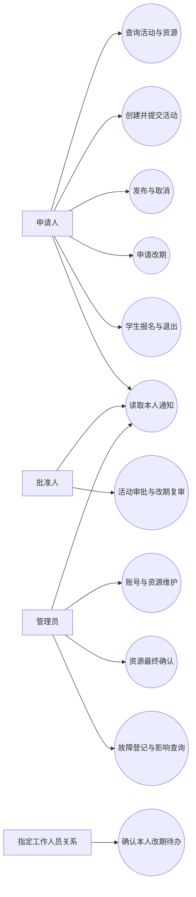

# 校园活动协同与资源调度系统用例规约

版本：v1.1

日期：2026年10月9日

配套文件：[需求总规约](software-requirements.md)、[业务规则](business-rules.md)、[追踪矩阵](traceability.md)。

## 1 用例模型与说明

角色采用申请人、批准人、管理员。工作人员与报名人员是账号和活动之间的关系；学生／教师为身份，不新增角色。用例描述用户目标及系统可观察结果，共性质量和技术约束见补充规约。每个用例中的“保存”均指持久化结果。

图1表示系统使用者与主要业务目标之间的关系；各目标的操作条件、处理过程及结果在下列用例中说明。

所有用例共同要求：未登录拒绝访问（登录除外），账号停用或会话失效不得操作；写入前由后端复核权限及状态；重复命令遵循BR-29，旧版本不覆盖当前数据；失败明确说明原因并保留可恢复输入。通知应与实际业务结果及关联版本一致，并按人员关系和访问权限发送。

| 编号 | 用户目标 | 主要参与者 | 需求 |
| --- | --- | --- | --- |
| UC-01 | 登录与退出 | 全部角色 | FR-01 |
| UC-02 | 管理账号身份与授权 | 授权管理员 | FR-02、03 |
| UC-03 | 查询活动及资源日历 | 申请人及授权人员 | FR-06、11 |
| UC-04 | 维护资源及申请资格 | 授权管理员 | FR-04、05 |
| UC-05 | 创建或编辑活动草稿 | 申请人 | FR-07 |
| UC-06 | 提交或撤回活动申请 | 活动所有者 | FR-08 |
| UC-07 | 审批活动申请 | 批准人 | FR-09 |
| UC-08 | 确认首次资源预约 | 资源确认管理员 | FR-10 |
| UC-09 | 发布活动 | 活动所有者 | FR-11 |
| UC-10 | 报名或退出活动 | 学生身份申请人 | FR-12、13 |
| UC-11 | 查看冲突并比较备选 | 活动所有者及授权审批人员 | FR-14、15 |
| UC-12 | 预览并创建改期申请 | 活动所有者 | FR-16、17 |
| UC-13 | 确认工作人员改期待办 | 指定工作人员 | FR-18 |
| UC-14 | 复审改期申请 | 批准人 | FR-19 |
| UC-15 | 最终确认并切换改期 | 资源确认管理员 | FR-20 |
| UC-16 | 撤回改期 | 活动所有者 | FR-17 |
| UC-17 | 取消活动 | 活动所有者 | FR-21 |
| UC-18 | 登记故障及查看影响 | 资源管理员 | FR-22 |
| UC-19 | 读取本人通知 | 全部角色 | FR-23 |
| UC-20 | 查询报名及业务历史 | 所有者及必要授权人员 | FR-13、24 |

## 2 UC-01 登录与退出

- **目标与参与者**：用户以本人账号进入工作区，并在退出后终止会话。
- **触发**：打开登录页或选择退出。
- **前置条件**：登录时已具备账号；退出时有当前会话。
- **输入**：用户名、密码。
- **基本流程**：
  1. 用户输入凭据并提交
  2. 系统检查账号启用状态及密码
  3. 建立8小时有效会话并返回用户信息
  4. 页面进入活动列表并按权限展示导航
  5. 用户选择退出
  6. 系统删除当前会话，页面清除凭据并回到登录页。

- **替代与异常**：
  - 2a. 密码错误、账号停用或认证失败，显示统一认证错误且不建立会话
  - 3a. 会话过期或被停用，后续请求拒绝并要求重新登录
  - 4a. 刷新页面时校验当前会话，校验失败回登录
  - 6a. 退出网络结果不明确时，清除本地会话并提示服务器退出结果待核实，不展示虚假成功。

- **成功后置条件**：登录建立有效会话；服务器确认退出后旧令牌失效。
- **最小保证**：不返回密码、密码哈希或内部认证细节。
- **规则与验收**：BR-01、05；D-AT-01及N-AT-01；页面UI-01。

## 3 UC-02 管理账号身份与授权

- **目标与参与者**：拥有账号管理权限的管理员建立和维护用户身份及操作范围。
- **触发**：进入账号管理并新建、调整授权或停用账号。
- **前置条件**：已登录且具备相应账号管理权限；目标组织存在。
- **输入**：用户名、显示名、初始密码、组织、教师／学生身份、角色、授权范围或启用状态。
- **基本流程**：
  1. 系统列出允许管理的账号
  2. 管理员录入或选择目标账号
  3. 明确身份、角色、批准组织和资源类别／资源管理范围
  4. 系统校验数据及操作权限
  5. 持久化并记录修改
  6. 页面显示最新授权和启用状态。

- **替代与异常**：
  - 4a. 用户名重复、组织不存在、密码不足8位或授权字段无效，拒绝并保留输入
  - 4b. 只有资源权限的管理员尝试管理账号，拒绝
  - 5a. 停用使现存令牌失效
  - 5b. 授权变更后后续操作按最新权限检查；身份变更后，新的申请和待资源复核事项应重新检查申请资格。

- **成功后置条件**：账号资料和授权可重新查询，修改可追踪。
- **最小保证**：管理员角色不自动产生批准或资源复核资格；其他业务安排不因本次无关操作自动修改。
- **规则与验收**：BR-01、02；D-AT-01／02、N-AT-01／06；页面UI-11。

## 4 UC-03 查询活动及资源日历

- **目标与参与者**：申请人了解公开活动、本人事项和资源占用；批准人／管理员查询职责范围内事项。
- **触发**：打开活动列表、活动详情或资源日历，改变日期、筛选条件。
- **前置条件**：已登录；详情对象存在且可查看。
- **输入**：本人／公开／审核范围、活动状态、日期区间、资源或类型。
- **基本流程**：
  1. 系统按角色和关系加载列表
  2. 用户选择日期及资源
  3. 展示场地占用、布场、主体、撤场和设备同时用量
  4. 用户点击时间块
  5. 明细展示其有权查看的信息及活动入口
  6. 用户打开详情查看有效安排、版本、状态和实时风险。

- **替代与异常**：
  - 1a. 无数据提供创建或调整筛选入口
  - 1b. 列表截断提示最多200项，不能显示为完整总数
  - 2a. 日历请求超过7天拒绝并提示调整范围
  - 5a. 无私有活动访问权限，只显示“已占用”并无私有详情链接
  - 6a. 不存在／无权限分别给出对应反馈，不泄露名单。

- **成功后置条件**：用户获得授权范围内最新信息，不写预约。
- **最小保证**：不通过日历、列表或链接泄露私有活动及个人信息。
- **规则与验收**：BR-05、06、09；D-AT-04／05／18／21／23；页面UI-02／04／05。

## 5 UC-04 维护资源及申请资格

- **目标与参与者**：资源管理员建立资源和其教师／学生申请规则。
- **触发**：资源管理页选择新增资源或调整资格。
- **前置条件**：已登录且对目标资源具备管理权限。
- **输入**：类型、名称、类别、容量／库存、每日开放时段、两类身份申请许可。
- **基本流程**：
  1. 选择场地或设备并填写资料
  2. 设置教师和学生分别是否可申请
  3. 系统检查容量、库存和时段
  4. 保存资源
  5. 后续仅调整身份资格时，系统保存新资格及前后值记录
  6. 查询页展示资格状态和受限原因。

- **替代与异常**：
  - 3a. 场地quantity不为1、容量非正、设备capacity非空、库存非正或开放时间逆序，拒绝
  - 5a. 调整资格后待确认申请按最新资格检查
  - 5b. 已生效预约保留
  - 5c. 尝试修改创建后的容量、库存、时段、名称或类别，首版不给修改入口
  - 6a. 两类均关闭时拒绝新增申请。

- **成功后置条件**：资源和资格持久化且可追踪，符合资格的候选搜索使用新配置。
- **最小保证**：资格修改不隐式释放旧预约；超出管理范围的修改拒绝。
- **规则与验收**：BR-03、04、08、10；N-AT-02／03／04／06；页面UI-06。

## 6 UC-05 创建或编辑活动草稿

- **目标与参与者**：申请人形成可提交的完整活动策划。
- **触发**：选择创建活动或编辑本人草稿。
- **前置条件**：有申请权限；编辑时为本人DRAFT，读取了当前lockVersion。
- **输入**：标题、公开简介、预计人数、报名容量、起止时间、布撤场、主场地、设备数量及工作人员。
- **基本流程**：
  1. 填写基本信息
  2. 选择时间和符合身份资格的资源
  3. 指定本组织工作人员
  4. 系统校验字段和人员
  5. 新建活动保存版本1，或编辑保存新不可变版本
  6. 获得activityId后可执行资源预览，页面显示草稿及校验结果。

- **替代与异常**：
  - 4a. 时间在过去、时长越界、人数不符、资源类型错误或人员无效，贴近字段提示
  - 4b. 资源受限显示原因，提交前必须更换
  - 5a. 非草稿禁止直接修改，已预约活动提示改期入口
  - 5b. 旧lockVersion返回STALE_VERSION，保留输入并加载最新状态
  - 6a. 存在资源占用冲突可保存符合输入约束的草稿，但不得称为已预约。

- **成功后置条件**：草稿及新版本持久化；当前无有效资源占用。
- **最小保证**：旧内容版本保留，失败不会覆盖他人或最新版本。
- **规则与验收**：BR-03、06～08、11；D-AT-03／20；页面UI-03。

## 7 UC-06 提交或撤回活动申请

- **目标与参与者**：所有者将草稿交业务审批，或在未预约阶段收回申请。
- **触发**：点击提交申请或撤回申请。
- **前置条件**：本人活动；提交为DRAFT；撤回为PENDING_TEACHER或APPROVED_UNRESERVED；并发版本匹配。
- **输入**：当前lockVersion，撤回时原因。
- **基本流程**：
  1. 用户确认当前内容
  2. 系统校验身份资格、完整内容、状态和权限
  3. 提交时绑定当前版本，转PENDING_TEACHER
  4. 保存提交记录和事件
  5. 撤回时说明原因，复制当前内容生成新版本DRAFT
  6. 页面显示待审批或新草稿及过程记录。

- **替代与异常**：
  - 2a. 任一资源资格受限拒绝提交且不占资源
  - 2b. 并发审批或他人更新导致版本过期，刷新后重新选择操作
  - 5a. 已预约或已发布禁止此撤回方式，应改期或取消
  - 5b. 旧审批保留历史但不对新版本有效。

- **成功后置条件**：申请待审批，或形成新草稿且旧审批失效。
- **最小保证**：提交、业务批准和撤回均不创建预约。
- **规则与验收**：BR-03、11、12；D-AT-03／20、N-AT-02；页面UI-03／04。

## 8 UC-07 审批活动申请

- **目标与参与者**：批准人决定授权范围内活动是否通过业务审核。
- **触发**：从审批待办进入待审批活动。
- **前置条件**：PENDING_TEACHER；批准权限、组织及类别范围满足；不是活动所有者；版本匹配。
- **输入**：同意或驳回、意见、当前lockVersion。
- **基本流程**：
  1. 查阅待审批的内容版本和安排
  2. 填写意见并同意
  3. 系统复核权限、回避及版本
  4. 保存决定、审批人和时间
  5. 活动变APPROVED_UNRESERVED
  6. 页面显示业务已批准、资源尚未确认。

- **替代与异常**：
  - 2a. 驳回必须说明理由，记录后回DRAFT
  - 3a. 仅有教师身份、组织不符、类别不在范围或本人活动均拒绝
  - 3b. 已撤回或其他人已处理，禁止覆盖，显示当前状态。

- **成功后置条件**：当前版本有业务审批结果，无资源占用。
- **最小保证**：审核内容与保存版本一致，越权不产生成功审批记录。
- **规则与验收**：BR-01、02、11、12；D-AT-02／03／20、N-AT-01／06；页面UI-09／04。

## 9 UC-08 确认首次资源预约

- **目标与参与者**：资源确认管理员为已批准活动建立完整预约。
- **触发**：从资源待办选择确认资源。
- **前置条件**：APPROVED_UNRESERVED；管理员具备全部所需资源确认权限，不是所有者；版本匹配。
- **输入**：活动ID和当前lockVersion。
- **基本流程**：
  1. 查看批准的具体版本
  2. 确认资源
  3. 系统复核最新身份资格、时间、容量、设备峰值及故障
  4. 全部可行时一次事务建立主场地和设备预约
  5. 活动变SCHEDULED并设置有效版本
  6. 返回完整预约结果和记录。

- **替代与异常**：
  - 3a. 任一资源冲突，返回详细冲突，保持APPROVED_UNRESERVED、无部分预约
  - 3b. 资格已调整或权限不足，拒绝，不产生预约
  - 3c. 两个活动同时抢相同场地，最多一个成功，另一得到冲突
  - 4a. 数据库异常整体回滚
  - 6a. 重复相同命令重放原结果，不重复占用。

- **成功后置条件**：全部必要资源同时预约，日历与活动状态一致。
- **最小保证**：无部分预约，不以业务批准代替资源确认。
- **规则与验收**：BR-03、08、09、13、29、30；D-AT-06／07／08、N-AT-04／05／06；页面UI-09／04。

## 10 UC-09 发布活动

- **目标与参与者**：所有者公开已预约活动，开放报名。
- **触发**：活动详情点击发布。
- **前置条件**：本人SCHEDULED活动，尚未开始，实时风险NORMAL，版本匹配。
- **输入**：当前lockVersion。
- **基本流程**：
  1. 查阅已确认安排
  2. 点击发布
  3. 系统重新检查状态、时间和风险
  4. 活动变OPEN
  5. 公开列表可查看安排和报名容量。

- **替代与异常**：
  - 3a. 未确认资源、已开始、故障风险或无权限，拒绝并说明
  - 3b. 状态已变化，刷新后展示最新结果。

- **成功后置条件**：OPEN持久化，符合条件学生可报名。
- **最小保证**：公开详情不包含私有审批意见和工作人员ID。
- **规则与验收**：BR-05、14；D-AT-03／18／21；页面UI-04／02。

## 11 UC-10 报名或退出活动

- **目标与参与者**：学生身份账号参加公开活动或释放本人名额。
- **触发**：详情报名区域选择报名或退出。
- **前置条件**：OPEN且未开始，无待处理改期；当前有效版本匹配；本人学生身份及相关访问权限有效。
- **输入**：JOIN或WITHDRAW、expectedVersionNo。
- **基本流程**：
  1. 展示有效报名人数、容量和本人状态
  2. 用户点击报名
  3. 系统检查状态、版本及剩余容量
  4. 保存本人ACTIVE关系并更新并发版本
  5. 页面持续显示已报名及人数
  6. 用户退出时把本人关系改为WITHDRAWN并释放名额。

- **替代与异常**：
  - 3a. 满额为CAPACITY_FULL，不新增报名
  - 3b. 20个不同学生抢1名额，恰1成功
  - 3c. 待改期返回CHANGE_PENDING，说明冻结原因
  - 3d. 有效版本已变返回STALE_VERSION，要求查看新安排后操作
  - 4a. 本人已ACTIVE重复JOIN返回原记录
  - 6a. 已WITHDRAWN重复退出返回原记录，无历史退出为INVALID_STATE
  - 6b. 退出后重新报名需重新检查名额。

- **成功后置条件**：有效人数不超过容量，报名关系唯一且可查询。
- **最小保证**：失败不占名额，不向学生提供他人名单。
- **规则与验收**：BR-05、15、16、26；D-AT-15／16／20／21；页面UI-04。

## 12 UC-11 查看冲突并比较备选

- **目标与参与者**：所有者或负责审批的人员理解冲突并选择较合适安排。
- **触发**：输入目标安排，点击检查资源或查看备选。
- **前置条件**：活动已保存有ID；有对应预览权限；基础版本有效。
- **输入**：baseVersionNo、目标Plan。
- **基本流程**：
  1. 系统验证输入、权限和资格
  2. 检查主场地及全部设备
  3. 展示每项冲突区间、需求、可用数及原因
  4. 在规定范围生成符合资格和硬约束的备选
  5. 返回最多5项及排序理由、搜索范围和截断标志
  6. 用户选2～3项比较时间变化、场地和设备替换
  7. 所有者选择目标，用于后续草稿编辑或改期影响预览。

- **替代与异常**：
  - 2a. 排除同一活动自身旧预约，不能误判自身为竞争者
  - 4a. 无方案时说明仅当前搜索范围未找到，引导人工调整
  - 4b. 候选不足300仍可返回，达预算截断要说明
  - 4c. 同类替换资源无申请资格应过滤
  - 7a. 选择不代表占位，不直接预约；目标有冲突仍可按BR-20创建改期，但页面必须持续提示最终复核风险。

- **成功后置条件**：获得可解释且有范围的计算结果；无预约或改期写入。
- **最小保证**：不展示“全局最优”，不泄露竞争活动私有资料。
- **规则与验收**：BR-17～20、25；D-AT-04～06／09／13／22、N-AT-03；页面UI-07。

## 13 UC-12 预览并创建改期申请

- **目标与参与者**：所有者明确变更影响后提交确定目标。
- **触发**：本人活动详情选择申请改期。
- **前置条件**：未开始的SCHEDULED／OPEN活动，无其他待处理改期；目标开始在未来。
- **输入**：baseVersionNo、expectedLockVersion、targetPlan、原因。
- **基本流程**：
  1. 显示当前有效安排和实时风险
  2. 用户输入目标并查看冲突及备选
  3. 选定目标后重新预览该目标的影响
  4. 展示资源差异、审批重置、待确认人员、报名人数及通知影响
  5. 用户填写原因并确认最后目标
  6. 系统锁定并复核版本、权限、最新资格和无待处理改期
  7. 保存不可变目标、影响快照、工作人员待办和事件
  8. 有其他工作人员进入AWAITING_CONFIRMATIONS，否则PENDING_TEACHER
  9. 暂停该活动报名及退出。

- **替代与异常**：
  - 3a. 选择了新备选必须重新计算，不能提交此前目标
  - 6a. 报名或其他操作导致lockVersion过期，返回STALE_VERSION并重新展示最新影响
  - 6b. 已有改期或目标资源资格受限，拒绝
  - 6c. 目标资源仍有冲突可创建，但应明确未占位、最终可能失败
  - 7a. 数据库异常整体回滚，不遗留冻结。

- **成功后置条件**：唯一待处理改期及影响快照持久化，原有效安排不变。
- **最小保证**：不能提前把目标当作当前安排；工作人员视图脱敏。
- **规则与验收**：BR-20～22、26、27；D-AT-09／10／15／20、N-AT-03／04；页面UI-07。

## 14 UC-13 确认工作人员改期待办

- **目标与参与者**：被指定的工作人员就本人职责确认新安排。
- **触发**：从通知或改期详情进入本人待确认事项。
- **前置条件**：本人在requiredStaff名单，改期AWAITING_CONFIRMATIONS，账号启用。
- **输入**：同意／拒绝及意见。
- **基本流程**：
  1. 查看原新安排、影响和实时风险
  2. 本人同意
  3. 系统保存本人决定和时间
  4. 未全同意仍待其他人
  5. 全部同意进入PENDING_TEACHER，页面更新时间线。

- **替代与异常**：
  - 2a. 拒绝需理由，改期REJECTED并解除冻结，原安排保留
  - 3a. 重复相同决定返回当前结果，无重复事件
  - 3b. 已决定后反向决定为ALREADY_DECIDED
  - 3c. 非名单人员或替别人确认拒绝
  - 3d. 活动已取消或申请已终结，不接受新决定。

- **成功后置条件**：本人决定可追踪，状态仅按有效确认推进。
- **最小保证**：通知已读不能替代确认，拒绝不改变原预约。
- **规则与验收**：BR-05、23、26、31；D-AT-10／11／19／21；页面UI-08。

## 15 UC-14 复审改期申请

- **目标与参与者**：批准人审核已完成工作人员确认的目标安排。
- **触发**：待办选择改期复审。
- **前置条件**：PENDING_TEACHER；批准人满足组织和类别范围且非所有者。
- **输入**：同意／驳回和意见。
- **基本流程**：
  1. 查阅不可变目标、影响和工作人员确认
  2. 同意目标
  3. 系统复核权限、状态及基础版本
  4. 将决定绑定该改期并记录时间
  5. 状态PENDING_RESOURCE。

- **替代与异常**：
  - 2a. 驳回并说明理由，REJECTED，原预约保留且解除冻结
  - 3a. 申请已撤回、被取消或越权，拒绝
  - 4a. 目标变化需要新申请，旧意见不能复用。

- **成功后置条件**：确定目标具备复审记录，尚未切换资源。
- **最小保证**：业务同意不承诺资源可用。
- **规则与验收**：BR-02、24、26；D-AT-10／11／20、N-AT-06；页面UI-08／09。

## 16 UC-15 最终确认并切换改期

- **目标与参与者**：资源确认管理员将已复审目标安全切换为新安排。
- **触发**：改期资源待办点击确认通过或拒绝。
- **前置条件**：PENDING_RESOURCE；管理范围覆盖必要资源，非活动所有者；基础版本仍为当前有效版本，活动未取消且未开始。
- **输入**：同意／拒绝和意见。
- **基本流程**：
  1. 查看原新安排、审批和实时风险
  2. 管理员确认
  3. 系统锁活动、改期及新旧资源并重查资格和资源
  4. 资源可行时新建活动内容版本
  5. 同一事务释放旧预约、写新预约、更新有效报名版本、置APPLIED及appliedVersionNo，保存审计和outbox
  6. 提交后刷新有效安排和日历
  7. 通知异步送达相关人员。

- **替代与异常**：
  - 2a. 管理员拒绝并说明理由，REJECTED、原安排不变
  - 3a. 预览后资源被抢占，持久化CONFLICTED及冲突，返回RESOURCE_CONFLICT，原版本和预约保留
  - 3b. 最新资格不符，拒绝切换，说明受限资源及原因，原有效安排保留
  - 3c. 取消已生效或基础版本过期，拒绝旧请求
  - 5a. 任一步数据库异常，版本、预约、报名、改期、审计和outbox全部回滚
  - 7a. 通知投递失败独立重试，不撤回已提交安排。

- **成功后置条件**：新有效版本和完整新预约生效，旧预约RELEASED、报名保留；活动保持原SCHEDULED／OPEN。
- **最小保证**：失败不破坏原有效安排；原资源AT_RISK时仍明确显示风险。
- **规则与验收**：BR-24～27、30、31；D-AT-10／12～14／17～20、N-AT-04／05；页面UI-08／09。

## 17 UC-16 撤回改期

- **目标与参与者**：所有者结束尚未生效的改期申请。
- **触发**：改期详情点击撤回。
- **前置条件**：本人活动且改期处于三个待处理状态之一。
- **输入**：撤回原因。
- **基本流程**：
  1. 用户查看目标和进度
  2. 填写原因并确认撤回
  3. 系统验证权限及状态
  4. 改期WITHDRAWN并保存事件
  5. 页面显示已撤回，报名冻结解除。

- **替代与异常**：
  - 3a. 已生效／已拒绝／已冲突等终态不能撤回，提示当前状态
  - 3b. 与最终确认并发时以一致性检查后的状态处理，不撤销已提交的新安排。

- **成功后置条件**：本申请终结，原安排保持，后续可另建改期。
- **最小保证**：已确认人员意见留作历史，不能复用给新目标。
- **规则与验收**：BR-21、26、27、30；撤回及与最终确认竞争的检查场景；页面UI-08。

## 18 UC-17 取消活动

- **目标与参与者**：所有者终止活动并完整释放安排。
- **触发**：详情点击取消活动。
- **前置条件**：本人活动尚未开始；重复取消仍先检查所有权。
- **输入**：理由、当前lockVersion。
- **基本流程**：
  1. 展示取消将关闭改期、释放资源、取消有效报名
  2. 所有者填写原因并确认
  3. 系统保存原人员通知快照
  4. 一次事务关闭待改期、释放预约、活动CANCELLED、有效报名CANCELLED并写事件
  5. 页面持续显示取消结果
  6. 后续通知异步发送。

- **替代与异常**：
  - 2a. 用户关闭确认框不执行
  - 3a. 其他人取消或已开始拒绝
  - 4a. 与改期最终确认竞争，最终取消不得被旧请求恢复，不能残留预约或待改期
  - 4b. 合法所有者再次取消返回当前结果，不增加释放和通知
  - 4c. 执行异常整体回滚，可检查后重试。

- **成功后置条件**：CANCELLED、0条ACTIVE预约、0条有效待改期、0条ACTIVE报名。
- **最小保证**：保留历史和收件人快照，重复操作不重复副作用。
- **规则与验收**：BR-28～31；D-AT-17／08；页面UI-04。

## 19 UC-18 登记故障及查看影响

- **目标与参与者**：资源管理员登记不可用时段，识别影响但不自动改动活动安排。
- **触发**：资源管理页选择故障登记。
- **前置条件**：有对应资源管理权限。
- **输入**：资源、起止时刻、不可用数量、原因。
- **基本流程**：
  1. 输入故障
  2. 系统校验时间和数量
  3. 保存故障记录
  4. 从当前有效预约计算受影响活动
  5. 展示清单和AT_RISK
  6. 日历显示不可用数量，授权申请人在详情看到实时风险并自行决定改期或取消。

- **替代与异常**：
  - 2a. 数量≤0、超过库存或场地数量不是1，拒绝
  - 4a. 无受影响活动展示空清单
  - 4b. 重叠故障可用量最低0
  - 5a. 普通用户日历只见“资源不可用”而非私有原因
  - 6a. 后续改期失败，原预约仍保留风险。

- **成功后置条件**：故障可查询，后续调度考虑扣减，已有活动风险随查询计算。
- **最小保证**：不自动删预约、取消活动或把故障当成正常可用。
- **规则与验收**：BR-09、10、27；D-AT-18；页面UI-06／05／04。

## 20 UC-19 读取本人通知

- **目标与参与者**：用户查看本人应知事件并标记已读。
- **触发**：打开通知页或点击未读提醒。
- **前置条件**：已登录，目标通知属于本人。
- **输入**：未读筛选、通知ID。
- **基本流程**：
  1. 系统加载本人通知
  2. 展示事件、活动、关联版本、内容及时间
  3. 用户打开消息
  4. 持久化readAt
  5. 在仍有对象访问权限时，可跳转活动或改期详情执行对应操作。

- **替代与异常**：
  - 1a. 无通知展示空状态
  - 3a. 他人通知拒绝访问
  - 4a. 重复已读不改变审批或确认
  - 5a. 权限已变化或对象不可访问，解释原因，不因消息跳转绕过授权；消息尚未送达时可刷新，不能伪造通知列表。

- **成功后置条件**：本人读取状态保存，事件及版本可以辨识。
- **最小保证**：投递失败不回滚业务；同一事件对同一收件人仅一通知。
- **规则与验收**：BR-05、31、32；D-AT-19／21／23；页面UI-10。

## 21 UC-20 查询报名及业务历史

- **目标与参与者**：所有者及必要授权人员核对报名、版本、审批和变更过程。
- **触发**：活动详情打开报名、审批或操作记录页签。
- **前置条件**：具有该对象及所请求信息的访问权限。
- **输入**：活动ID、所选页签。
- **基本流程**：
  1. 查询当前活动
  2. 按职责请求名单或审计
  3. 展示有效报名数及授权名单
  4. 按记录展示操作者、时间、内容版本、决定和原因
  5. 对比改期历史及其生效版本，核对当前安排来源。

- **替代与异常**：
  - 2a. 普通学生只看本人报名，不能请求全名单
  - 2b. 工作人员只看到确认所需内容
  - 3a. 列表达到200项提示截断，人数使用真实计数
  - 4a. 无记录说明尚无操作，不能展示示例为真实历史。

- **成功后置条件**：用户获取可追溯信息，业务状态不变。
- **最小保证**：审计只追加，不允许通过查询页改写既往记录。
- **规则与验收**：BR-05、11、16、22、31；D-AT-10／19／21／23；页面UI-04／08。
