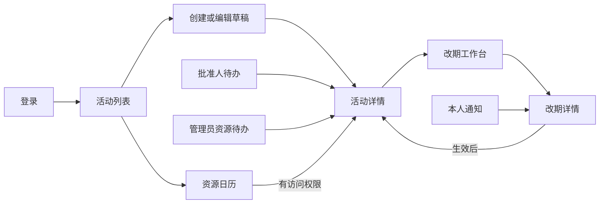

# 校园活动协同与资源调度系统用户界面说明

课程：软件综合实践

版本：v1.1

日期：2026年10月9日

配套文件：[软件需求规约](../requirements/software-requirements.md)、[用例规约](../requirements/use-cases.md)、[补充规约](../requirements/supplementary-specification.md)。

## 目录

1. 引言
2. 使用者与导航
3. 公共界面规范
4. 主要操作界面示意与文字说明
5. 全局异常与响应式状态
6. 典型操作流程
7. 界面一致性与检查要求

## 1 引言

### 1.1 编写目的

本文说明校园活动协同与资源调度系统的页面结构、导航关系、主要操作及信息反馈，为课程项目的界面设计、实现和检查提供依据。重点描述资源日历、冲突与备选方案、改期差异及影响、确认与审批时间线等界面。

### 1.2 适用范围

本文覆盖申请人、批准人和管理员使用的11类主要页面。每个界面说明包括使用者与入口、编号示意图、区域功能、操作过程以及异常和权限状态。工作人员通过活动关系执行本人确认，学生身份申请人可以报名及退出活动。

各图为界面设计示意，区域编号用于对应文字说明；示例活动、日期和人数用于说明布局和操作关系。设计示意与软件运行截图分别标注。

### 1.3 编制依据

本文依据软件需求规约、用例规约和补充规约编制，页面名称、角色、状态、输入条件和操作结果应与相应需求保持一致。

## 2 使用者与导航

### 2.1 角色入口

| 使用者 | 主要入口与动作 |
| --- | --- |
| 申请人 | 我的活动、公开活动、创建活动、资源日历、改期、通知；学生身份增加本人报名与退出 |
| 批准人 | 审批待办、授权活动详情、改期复审、通知 |
| 管理员 | 按授权显示资源管理、故障、资源复核、账号管理和记录查询 |
| 指定工作人员关系 | 通过本人通知及改期详情执行自己的确认，无额外系统角色 |

一个账号具备多角色时展示授权入口的并集，每项操作仍检查具体范围。导航上标“教师”不能代替批准权限；账号管理管理员不能因此看到未授权的资源确认按钮。

### 2.2 页面目录

| 编号 | 页面 | 入口／路由 | 关联用例 |
| --- | --- | --- | --- |
| UI-01 | 登录 | /login | UC-01 |
| UI-02 | 活动列表 | /activities | UC-03、05、09 |
| UI-03 | 活动申请表单 | /activities/new；本人草稿详情的编辑入口 | UC-05、06、11 |
| UI-04 | 活动详情 | /activities/:id | UC-03、06、09、10、17、20 |
| UI-05 | 资源日历 | /resources/calendar | UC-03 |
| UI-06 | 资源与资格管理 | /resources/manage | UC-04、18 |
| UI-07 | 改期工作台 | /activities/:id/change | UC-11、12 |
| UI-08 | 改期详情与确认 | /changes/:id | UC-13～16 |
| UI-09 | 审批及资源复核待办 | /reviews | UC-07、08、14、15 |
| UI-10 | 通知 | /notifications | UC-19 |
| UI-11 | 账号身份与授权管理 | /admin/users | UC-02 |

不新增独立数据统计首页；登录成功进入活动列表。身份、资格和细分授权在对应业务页面分别显示，并根据当前账号权限提供操作入口。

### 2.3 主流程导航



## 3 公共界面规范

桌面采用左导航224px、顶栏64px和内容边距24px。顶栏显示用户名称、业务角色、身份、通知入口及退出；涉及身份资格的页面显示“学生申请人”或“教师申请人”，避免把身份与批准权混淆。主要操作每一区域最多一个主色按钮。

背景`#F5F7FA`，面板白色，正文`#172B4D`，辅助文字`#5E6C84`，边线`#E2E8F0`，主色`#176B68`。冲突、风险和成功分别使用`#B42318`、`#9A6700`、`#157347`并配文字／图标。中文系统字体优先，正文14／16px、行高1.5；间距为8／16／24／32px，面板圆角12px。时间数字对齐，不靠颜色单独区分状态。

活动显示“草稿／待业务审批／已审批待资源确认／已预约／开放报名／已取消”；改期显示“待人员确认／待业务复审／待资源复核／已生效／已拒绝／冲突失效／已撤回／因活动取消关闭”。这些中文标签对应需求状态，审批操作依据批准权限提供，与教师身份分别设置。

## 4 主要操作界面示意与文字说明

以下线框中的`[编号]`是说明索引，不是实际页面文字。统一示例活动为“校园技术分享会”，演示日期2030年10月20日。

### 4.1 UI-01 登录界面

图1 登录页设计示意

```text
                  校园活动协同与资源调度系统
                  活动申请 · 资源预约 · 变更协同

                  [1] 账号  [                    ]
                  [2] 密码  [********************]
                  [3] 错误提示／提交中状态
                  [4]          登录

                  [5] 演示账号说明（仅开发演示环境）
```

角色与入口：全部使用者通过登录页进入。区域1、2为必填字段，密码遮盖显示；区域3持续显示认证失败或网络错误；区域4提交时禁止重复点击，成功进入活动列表；区域5不显示真实密码，正式运行关闭演示说明。

输入缺失时贴近字段提示，错误密码保持登录页并提示“账号或密码错误”，网络异常提示重试。页面可通过Tab切换字段和按钮、Enter提交。刷新后验证会话；会话失效回此页。关联UC-01。

### 4.2 UI-02 活动列表

图2 活动列表设计示意

```text
[1] 导航             [2] 当前用户：学生申请人  |  通知  |  退出
    我的活动
    公开活动         [3] 我的／公开／审核范围   状态筛选   日期筛选
    资源日历         [4] 活动列表                             创建活动
    审批待办             校园技术分享会    开放报名    资源正常
    通知                 10月20日 10:00—11:00  报告厅A   1／20
    管理入口             查看详情
                     [5] 空状态／加载失败／列表截断提示
```

角色与入口：登录后进入。区域1按权限生成导航，区域2显示角色与身份；区域3切换查看范围，区域4按创建时间降序展示活动及日期、资源风险、真实报名人数，申请权限有效时显示创建按钮；区域5提供加载、无活动、失败重试和最多200项的截断说明。

点击卡片打开有权查看的活动详情；“我的”包括本人所有及按参与关系允许查看的活动，公开只显示OPEN。审核入口仅有审批或资源职责的账号显示；范围外私有活动不出现在列表。日期筛选用于缩小显示范围，列表截断时应说明当前结果范围，避免将局部结果作为完整数量。关联UC-03、05、09。

### 4.3 UI-03 活动申请表单

图3 活动创建和草稿编辑设计示意

```text
[1] 活动申请      基本信息 → 时间资源 → 工作人员 → 检查提交

[2] 标题 [校园技术分享会       ]  简介 [公开介绍               ]
    预计人数 [60]                 报名容量 [20]
[3] 日期 [2030-10-20]  开始 [10:00]  结束 [11:00]
    布场 [30分钟]      撤场 [30分钟]
    主场地 [报告厅A]   设备 [投影设备组A ×2]
    身份：学生   仅教师会议室：不可申请（说明原因）
[4] 工作人员 [同组织启用账号多选]
[5] 校验：完整占用09:30—11:30；资源检查结果；资格提示
[6] 保存草稿        检查资源        提交申请
```

角色与入口：申请人点击创建，或从本人草稿详情进入编辑。区域2、3填写活动输入，区域4只选择本组织启用账号；区域5显示布撤场后的占用、人数限制及资格原因；区域6分别保存草稿、只读预览和提交审批。

保存草稿后可检查资源，检查结果用于辅助安排，不代表预约已经生效。最终提交重新检查资格及版本，成功进入待业务审批；保存／编辑形成新版本。受限资源不可被当作可申请选项，显示限制原因；已预约活动不给此处直接编辑入口，而引导改期。

主要字段校验如下：

| 字段 | 校验及提示 |
| --- | --- |
| 标题／简介 | 标题1～100字，简介≤2000字，计数提示 |
| 预计人数／报名容量 | 正整数且预计人数≥容量≥1；场地容量不足时提示 |
| 起止／布撤场 | 开始在未来、时长30分钟～6小时、布撤场各0～120分钟，展示完整占用；必须同日且处于全部资源开放区间 |
| 设备 | 正整数、资源不可重复、类别和资源类型正确 |
| 工作人员 | 同组织启用账号，去重；本人列入时说明不需要向自己确认 |

版本过期保留表单并刷新当前状态，不直接覆盖。关联UC-05、06、11。

### 4.4 UI-04 活动详情

图4 活动详情设计示意

```text
[1] 校园技术分享会     开放报名     当前有效版本1
[2] 当前安排：10月20日10:00—11:00；布撤场各30分钟
    报告厅A；投影设备组A×2；资源风险：正常／受故障影响
[3] 业务审批 → 资源确认 → 发布             操作者及时间
[4] 报名：1／20     本人状态：未报名     报名／退出
    待处理改期时：报名和退出暂停，查看原因
[5] 安排信息 | 工作人员 | 报名名单（授权） | 过程记录
[6] 本人可用操作：编辑／提交／撤回／发布／申请改期／取消
```

角色与入口：从活动列表、日历授权链接或通知进入。区域1分清内容版本和有效版本；区域2始终展示当前有效安排，故障风险以常驻条说明；区域3分开业务同意、资源预约和发布步骤；区域4只有学生身份且符合状态时可操作本人报名；区域5按访问权限开放相应内容；区域6随状态和所有权变化。

公开学生视角隐藏工作人员ID和名单按钮；工作人员只看到履职所需信息。取消需二次确认并填写原因，说明释放资源、关闭改期和取消有效报名，成功后显示已取消。满额、待改期、已开始等禁用理由就地可见。关联UC-03、06、09、10、17、20。

### 4.5 UI-05 资源日历

图5 资源日历设计示意（片段，正式页面显示08:00～22:00）

```text
[1] 资源日历  ← 2030-10-20 →  今天    类型／资源筛选    图例
[2] 资源名称固定列       09:00   09:30   10:00   11:00   11:30
    报告厅A                       [布场][活动主体][撤场]
    多功能厅B                     [       空闲       ]
    投影设备组A                   [同时已用2／总量2]
    故障层                        [不可用1件，数量叠加]
[3] 点击占用块 → 明细抽屉：资源、区间、数量、风险、授权活动入口
[4] 图例：布场浅底／活动实色／撤场浅底／故障纹理与文字
```

角色与入口：登录用户从资源日历进入。区域1控制日期和筛选；区域2使用30分钟刻度和资源行，实际块位置按分钟计算，器材显示同时用量而非预约数量简单求和；区域3提供明细；区域4说明视觉表达。

场地显示完整占用的分段，设备显示“已用／总量”，故障另显示不可用数量和当前可用量，不能只显示库存作为可用量。无私有活动权限时块标签为“已占用”，抽屉无活动标题及私有链接；故障条目只显示“资源不可用”。宽屏可在日历容器滚动，资源名列固定；移动采用资源与时段列表。关联UC-03。

### 4.6 UI-06 资源、资格和故障管理

图6 资源管理设计示意

```text
[1] 资源管理    场地／设备筛选                         新增资源
[2] 名称         容量／库存   开放时间   教师申请   学生申请   操作
    会议室C       30人        08—22       允许       禁止     资格／故障
    投影设备A     2件         08—22       允许       允许     资格／故障
[3] 资格弹窗：教师可申请[✓]  学生可申请[ ]  原设置→新设置  保存
[4] 故障弹窗：起止时间、不可用数量、原因                  登记
[5] 受影响活动：活动名、版本、安排、AT_RISK、授权详情入口
```

角色与入口：有资源管理权限的管理员。区域2展示具体资源和四种资格组合；区域3独立修改身份资格，说明“已生效预约保留，新的申请与改期按最新资格检查”；区域4登记故障；区域5显示真实影响清单。

新增时填写类型、名称、类别、容量或库存、开放时间；首版基本资料创建后仅供查询，申请资格通过独立入口调整。故障时间、数量非法时贴近字段提示；无影响显示“当前无受影响活动”。保存资格应记录操作者、时间与前后内容。资格调整成功后应在资源列表显示新设置。关联UC-04、18。

### 4.7 UI-07 改期工作台及方案比较

图7 改期目标与冲突设计示意

```text
[1] 当前有效安排版本1：10:00—11:00，报告厅A，投影A×2
[2] 目标输入（保留在左侧）       [3] 冲突（右侧）
    15:00—16:00                      场地：14:30—16:30已占用
    布撤场各30分钟                   设备：需求2，可用1，缺1
    报告厅A；投影A×2                 检查区间14:30—16:30
    预览冲突与备选
[4] 方案卡片（最多5项）             勾选2～3项比较
    当前排序首选：15:00—16:00；厅B＋投影B×2
    时间偏移0；换场地；替换设备1项  搜索±120分钟／最多300组
[5] 选定目标 → 重新预览影响 → 填写理由 → 创建申请
```

角色与入口：本人未开始的SCHEDULED／OPEN活动。区域1是当前有效安排，区域2保留目标输入；区域3按资源精确解释冲突；区域4以相同维度比较时间偏移、场地变化、设备替换和排序依据；区域5确保实际创建的目标等于最后确认方案。

图8 改期差异与影响设计示意

```text
[1] 当前有效安排                    [2] 申请的新安排
    10:00—11:00                         15:00—16:00（突出变化）
    报告厅A、投影A×2                    多功能厅B、投影B×2
[3] 资源：释放A／投影A，获取B／投影B；同资源时间变化也标注
[4] 审批：本申请须重新业务审批与资源复核
[5] 人员：1名其他工作人员需确认
[6] 报名与通知：1名有效报名学生保留报名并收到通知
[7] 原资源风险：实时风险提示       改期原因[           ]  创建申请
```

文字说明：选中备选不直接预约，必须重新计算该目标影响并展示图8。报名学生不需要同意；工作人员需确认的是除所有者外的名单；人数使用真实计数，通知收件人数按人员并集去重。目标资格受限时拒绝创建并说明具体资源；目标尚有资源冲突时可以提交申请但持续说明最终可能失败。无备选只表示当前范围未找到，给人工调整入口；不称“全局最优”。

提交成功跳改期详情并冻结报名；旧版本错误保留输入，更新当前安排并重新预览影响；网络未知结果提示先检查状态，重试同一命令不能重新产生一份申请。关联UC-11、12。

### 4.8 UI-08 改期详情与确认

图9 改期确认与结果设计示意

```text
[1] 校园技术分享会改期申请     待人员确认／待复审／待资源复核／终态
[2] 当前有效安排 | 申请目标 | 影响摘要 | 实时资源风险
[3] 时间线
    申请提交      所有者、时间、基础版本和原因
    工作人员      本人／其他人：待决定、同意或拒绝及意见
    业务复审      批准人、时间、决定及意见
    资源复核      管理员、时间、成功／冲突／拒绝
    最终结果      已生效版本2／原安排未修改／执行结果待核实
[4] 本人当前动作：同意／拒绝（需理由）／撤回／查看当前活动
[5] 冲突失败原因、重新预览入口；如原资源故障，常驻风险条
```

角色与入口：所有者、对应工作人员、批准人及资源确认管理员按权限进入。区域3区分确认与审批阶段，含操作者、时间、意见和版本；区域4仅展示本人可执行动作，工作人员不能代确认，所有者不向自己确认；区域5保留失败原因及后续处理入口。

成功显示“已生效，当前有效版本2”并刷新活动及日历；资源冲突显示“本次改期未修改原安排，请重新预览并创建申请”；原资源有故障则同时显示“原资源受故障影响”。执行异常或网络超时不能直接写已生效，应查询当前记录并提供同命令重试。任何终态不显示可继续审批的按钮；已读通知不会更新确认决定。关联UC-13～16。

### 4.9 UI-09 审批及资源复核待办

图10 待办设计示意

```text
[1] 待办  业务审批 | 改期复审 | 首次资源确认 | 改期资源复核
[2] 活动／申请         组织       内容版本     当前步骤      查看
    校园技术分享会     软件学院    版本1        业务审批      详情
    技术分享会改期     软件学院    基础版本1    资源复核      详情
[3] 详情区：申请内容／原新安排／影响／资格与资源检查
[4] 处理意见[                      ]     驳回／拒绝    同意／确认
[5] 本人申请回避、超范围或已处理时显示原因并停止操作
```

角色与入口：批准人及具有资源复核权限的管理员。区域1只展示授权类别，区域2按组织和类别／资源范围筛选，不能漏掉OPEN活动中的改期待办；区域3查看确定内容；区域4分开业务同意和资源确认，拒绝须原因；区域5解释不能操作的原因。

待办加载应控制请求数量，避免大量同时请求影响页面使用。处理成功刷新待办和详情；版本过期或已被其他人处理显示当前记录，不能再次覆盖。具有多角色者也不能处理本人申请。关联UC-07、08、14、15。

### 4.10 UI-10 通知

图11 通知页设计示意

```text
[1] 我的通知      全部／未读                        刷新
[2] ● 活动改期已生效  校园技术分享会  版本2   时间
      新安排15:00—16:00，多功能厅B                  查看详情
    ● 工作人员确认待办  活动名称、基础版本           前往确认
    ○ 活动已取消        原因及关联版本               查看详情
[3] 阅读内容／标记已读         已读不代表确认或审批
[4] 无通知／加载失败／重试／列表截断说明
```

角色与入口：全部角色，只加载本人通知。区域2标出未读、事件、版本及时间；区域3只修改读取状态，需要人员确认时跳相应详情执行独立决定；区域4处理空状态和失败。消息跳转仍检查对象权限，不能凭通知得到越权详情。页面通过轮询或用户刷新更新，首版不引入WebSocket。关联UC-19。

### 4.11 UI-11 账号身份与授权管理

图12 账号管理设计示意

```text
[1] 账号管理                                     新建账号
[2] 用户名     显示名     组织      身份    角色      启用状态
    user_a     演示用户   软件学院  教师    申请人    启用
[3] 账号表单：用户名、显示名、初始密码、组织
    身份：教师／学生     角色：申请人／批准人／管理员（可多选）
[4] 批准授权：组织范围、资源类别；管理授权：账号／资源／资源复核
    资源管理范围：[明确选择]
[5] 保存修改   启用／停用确认   修改记录
```

角色与入口：具备账号管理权限的管理员。区域3将身份和角色分开；区域4明确范围及细分权限，不能用一个“管理员”复选框代替所有授权；区域5修改需保存并记录，停用前说明旧会话将失效。

用户名重复、组织无效、密码不足8位或范围未满足规则时保留输入并说明。教师身份不默认勾选批准人，账号管理权限不默认勾选资源确认。身份及授权修改成功后应显示最新设置，并记录修改内容。关联UC-02。

## 5 全局异常与响应式状态

| 场景 | 页面应显示 | 操作结果 |
| --- | --- | --- |
| 加载中 | 骨架／进度，提交按钮短暂禁用 | 不显示旧数据为最新成功 |
| 空数据 | 尚无活动／暂无待办／无通知；给合适入口 | 不填示例记录冒充真实结果 |
| 资格受限 | 具体资源及“仅教师可申请”等原因 | 阻止越过资格提交，提供更换资源入口 |
| 401 | 登录已失效，返回登录 | 重新认证后查询原事项 |
| 403 | 无操作权限或超范围，给返回入口 | 不泄露受限详情，不只依赖隐藏按钮 |
| 404 | 记录不存在或已不可访问 | 返回列表重新查询 |
| 400 | 字段错误贴近输入 | 保留输入并纠正 |
| 409旧版本 | 记录已更新，显示最新状态 | 保留未提交输入，重新预览／决定 |
| 资源冲突 | 资源、区间、缺口、当前安排状态 | 查看备选；最终失败需新申请 |
| 待改期冻结 | 报名和退出暂停，显示改期入口 | 等终态后按活动条件恢复 |
| 网络超时／服务器错误 | 结果尚未确认或提交失败，带可查询的追踪标识 | 先查状态，必要时复用原命令重试；不盲目展示成功 |
| AT_RISK | 常驻“资源受故障影响”并说明时间与资源 | 原记录保留，用户自主申请改期或取消 |
| 移动390×844 | 折叠导航，活动详情纵向，通知与确认可达 | 日历和双列对比改列表；手机不要求完整排程编辑 |

弹窗正文可滚动且按钮始终可达；长活动名不能遮挡状态和主要动作。确认、拒绝、取消均可键盘完成。重要结果应保留在详情，不只显示一次短暂提示。

## 6 典型操作流程

### 6.1 首次申请到开放报名

申请人从活动列表进入创建页，依次填写基本信息、时间资源和工作人员，保存草稿后查看资源检查结果。确认内容后提交，由批准人在授权待办中审批。业务同意后，管理员重新核对资格及资源，联合预约成功时活动显示“已预约”；申请人随后发布，学生身份账号从公开详情报名。

该流程对应图3、图10和图4。提交和业务批准阶段不占用资源，资源最终确认后建立预约。业务审批和资源复核由申请人以外的相应授权账号执行。

### 6.2 改期成功与失败

申请人在图4进入图7，输入目标后查看冲突，比较备选并重新预览图8中的影响。确认目标及原因后创建申请，工作人员在图9处理本人待办；全部同意后批准人复审，管理员最终资源复核。生效后图4展示新有效安排，图5更新预约，图11出现关联版本通知。

工作人员拒绝、复审驳回或最终资源冲突时，本次改期不修改原有效安排；数据库异常时整体回滚。原资源已有故障时，详情页继续显示风险及受影响时段。

### 6.3 资格调整与故障登记

管理员在图6选具体资源调整教师／学生资格，保存后新申请、未预约申请及新的改期目标按最新资格判断，已有生效预约保留。登记故障后查看受影响清单，活动详情和日历同步展示风险；申请人再决定改期或取消。资格限制与物理故障分别说明，不能用故障代替身份规则。

## 7 界面一致性与检查要求

### 7.1 图示与文字的一致性

每幅界面图应具有图号和名称，区域编号与文字说明对应。页面上的活动名称、时间、人数、版本和状态应相互一致，主要按钮对应明确操作；禁用动作应提供原因。设计图中的申请资格、审批、预约、报名和改期规则与需求规约一致。

### 7.2 主要页面检查

| 检查范围 | 检查内容 |
| --- | --- |
| 登录与权限 | 账号输入、错误反馈、退出、导航与角色范围一致 |
| 活动表单与详情 | 字段校验、身份资格、版本、审批与预约、报名及取消反馈清楚 |
| 资源日历 | 布场、主体和撤场对应正确刻度，设备同时用量及故障数量清楚，明细符合权限 |
| 冲突与备选 | 冲突资源和时段准确，0项与5项方案布局合理，比较维度一致 |
| 改期差异与确认 | 原新安排、影响人数、确认和审批步骤清楚，成功与失败结果持续显示 |
| 通知与管理 | 已读和确认区分，账号身份、角色、授权范围及资源资格分别表达 |
| 通用状态 | 加载、空数据、错误重试、无权限、长文本、弹窗滚动和键盘焦点可用 |

### 7.3 不同视口要求

桌面页面按1366×768和1920×1080检查登录、资源日历、冲突备选、变更影响和确认结果；移动页面按390×844检查活动详情、通知及人员确认。图像资料应注明软件或原型版本、数据版本、浏览器、视口和操作状态。

复杂日历及对比内容采用容器滚动或列表布局，不能造成全页横向溢出；弹窗按钮应可达，长名称不遮挡状态和主要动作。界面检查发现的问题应记录并复核，用户手册中的步骤和截图应与对应交付版本一致。
